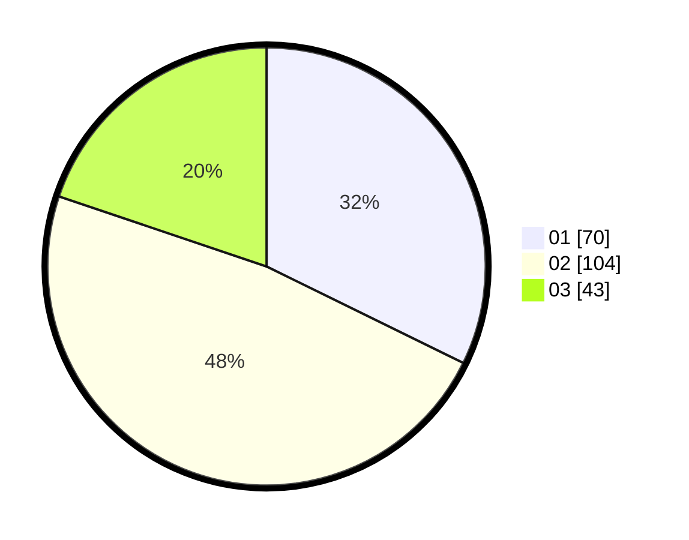

# Hasil

Hasil perolehan suara paslon dapat dilihat pada file paslon-01.txt, paslon-02.txt, dan paslon-03.txt.

Jika tidak ada, artinya data tersebut belum ada pada SIREKAP.

## Perolehan Suara

 * Paslon 01: **70**.
 * Paslon 02: **104**.
 * Paslon 03: **43**.

## Foto C Plano

https://sirekap-obj-formc.kpu.go.id/f1c4/pemilu/ppwp/31/75/09/10/03/3175091003023-20240214-225451--3ed4a0de-bbbb-42f0-a64a-4dd44a288424.jpg

https://sirekap-obj-formc.kpu.go.id/f1c4/pemilu/ppwp/31/75/09/10/03/3175091003023-20240214-225547--bd53770d-3eab-43a8-aeed-e12c8714cb60.jpg

https://sirekap-obj-formc.kpu.go.id/f1c4/pemilu/ppwp/31/75/09/10/03/3175091003023-20240214-225642--f7ad27f0-6924-4c1e-af49-94a12f5a7425.jpg
