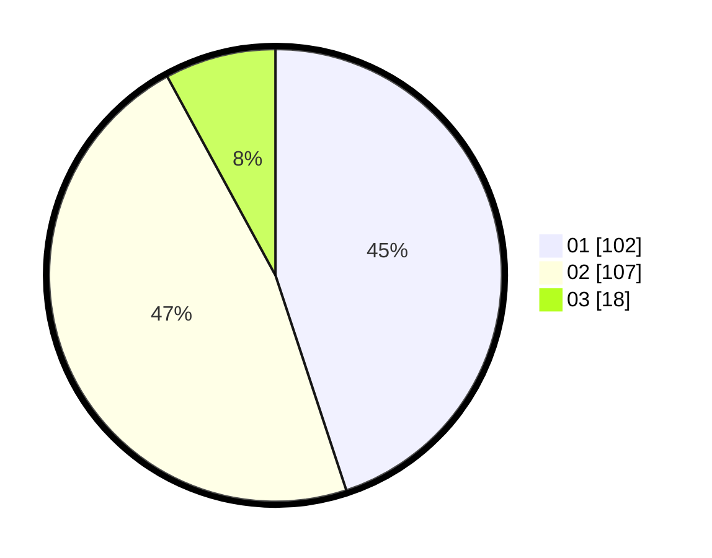

# Hasil

Hasil perolehan suara paslon dapat dilihat pada file paslon-01.txt, paslon-02.txt, dan paslon-03.txt.

Jika tidak ada, artinya data tersebut belum ada pada SIREKAP.

## Perolehan Suara

 * Paslon 01: **102**.
 * Paslon 02: **107**.
 * Paslon 03: **18**.

## Foto C Plano

https://sirekap-obj-formc.kpu.go.id/c9c4/pemilu/ppwp/31/75/09/10/03/3175091003035-20240214-211929--1d841bb3-3874-4e4e-94e4-c2b042c49fd6.jpg

https://sirekap-obj-formc.kpu.go.id/c9c4/pemilu/ppwp/31/75/09/10/03/3175091003035-20240214-185839--0c06447c-c124-46d8-ac37-699a6b782040.jpg

https://sirekap-obj-formc.kpu.go.id/c9c4/pemilu/ppwp/31/75/09/10/03/3175091003035-20240214-212140--751f5232-8c64-4833-a467-d9e383c530d7.jpg

## DATA PEMILIH TETAP

Jumlah pemilih dalam DPT: **452**.
 * L: **771**.
 * P: **221**.

## DATA PENGGUNA HAK PILIH

Jumlah pengguna hak pilih dalam DPT: **229**.
 * L: **102**.
 * P: **127**.

Jumlah pengguna hak pilih dalam DPTb: **0**.
 * L: **1**.
 * P: **0**.

Jumlah pengguna hak pilih dalam DPK: **0**.
 * L: **0**.
 * P: **0**.

Jumlah pengguna hak pilih: **230**.
 * L: **103**.
 * P: **127**.

## JUMLAH SUARA SAH DAN TIDAK SAH

JUMLAH SELURUH SUARA SAH: **227**.

JUMLAH SUARA TIDAK SAH: **3**.

JUMLAH SELURUH SUARA SAH DAN SUARA TIDAK SAH: **230**.
