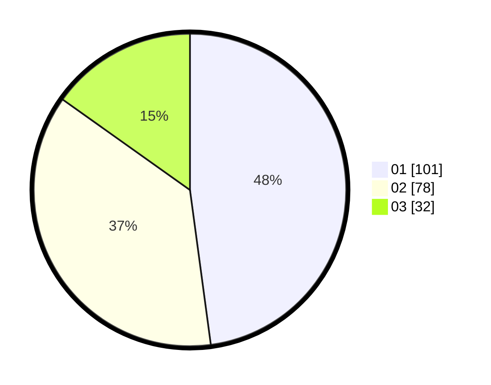

# Hasil

Hasil perolehan suara paslon dapat dilihat pada file paslon-01.txt, paslon-02.txt, dan paslon-03.txt.

Jika tidak ada, artinya data tersebut belum ada pada SIREKAP.

## Perolehan Suara

 * Paslon 01: **101**.
 * Paslon 02: **78**.
 * Paslon 03: **32**.

## Foto C Plano

https://sirekap-obj-formc.kpu.go.id/4172/pemilu/ppwp/31/75/09/10/03/3175091003038-20240216-154553--315c8530-2965-47d5-a378-0f934f563125.jpg

https://sirekap-obj-formc.kpu.go.id/4172/pemilu/ppwp/31/75/09/10/03/3175091003038-20240216-154554--4825911f-faed-4095-8a38-30186dce9600.jpg

https://sirekap-obj-formc.kpu.go.id/4172/pemilu/ppwp/31/75/09/10/03/3175091003038-20240216-154554--a400c8a6-9e43-4b6c-b7f2-7377bdc6d4b1.jpg

## DATA PEMILIH TETAP

Jumlah pemilih dalam DPT: **269**.
 * L: **128**.
 * P: **141**.

## DATA PENGGUNA HAK PILIH

Jumlah pengguna hak pilih dalam DPT: **209**.
 * L: **92**.
 * P: **117**.

Jumlah pengguna hak pilih dalam DPTb: **2**.
 * L: **1**.
 * P: **1**.

Jumlah pengguna hak pilih dalam DPK: **3**.
 * L: **3**.
 * P: **0**.

Jumlah pengguna hak pilih: **214**.
 * L: **96**.
 * P: **118**.

## JUMLAH SUARA SAH DAN TIDAK SAH

JUMLAH SELURUH SUARA SAH: **211**.

JUMLAH SUARA TIDAK SAH: **3**.

JUMLAH SELURUH SUARA SAH DAN SUARA TIDAK SAH: **214**.
