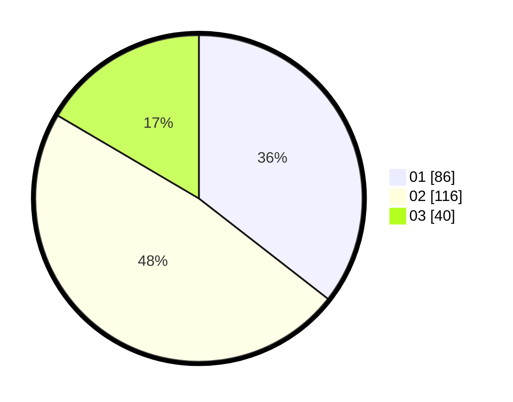

# Hasil

Hasil perolehan suara paslon dapat dilihat pada file paslon-01.txt, paslon-02.txt, dan paslon-03.txt.

Jika tidak ada, artinya data tersebut belum ada pada SIREKAP.

## Perolehan Suara

 * Paslon 01: **86**.
 * Paslon 02: **116**.
 * Paslon 03: **40**.

## Foto C Plano

https://sirekap-obj-formc.kpu.go.id/c1be/pemilu/ppwp/31/75/09/10/03/3175091003046-20240214-155157--f3be44e6-11d8-4065-9e93-2661e49c9858.jpg

https://sirekap-obj-formc.kpu.go.id/c1be/pemilu/ppwp/31/75/09/10/03/3175091003046-20240214-155710--ffa46894-1662-444e-91ed-3485d99a7a87.jpg

https://sirekap-obj-formc.kpu.go.id/c1be/pemilu/ppwp/31/75/09/10/03/3175091003046-20240214-155148--793d91f7-f8f0-40e4-bda9-422e8c8a0b01.jpg

## DATA PEMILIH TETAP

Jumlah pemilih dalam DPT: **292**.
 * L: **143**.
 * P: **249**.

## DATA PENGGUNA HAK PILIH

Jumlah pengguna hak pilih dalam DPT: **241**.
 * L: **120**.
 * P: **121**.

Jumlah pengguna hak pilih dalam DPTb: **1**.
 * L: **0**.
 * P: **1**.

Jumlah pengguna hak pilih dalam DPK: **0**.
 * L: **0**.
 * P: **0**.

Jumlah pengguna hak pilih: **242**.
 * L: **120**.
 * P: **122**.

## JUMLAH SUARA SAH DAN TIDAK SAH

JUMLAH SELURUH SUARA SAH: **242**.

JUMLAH SUARA TIDAK SAH: **0**.

JUMLAH SELURUH SUARA SAH DAN SUARA TIDAK SAH: **242**.
