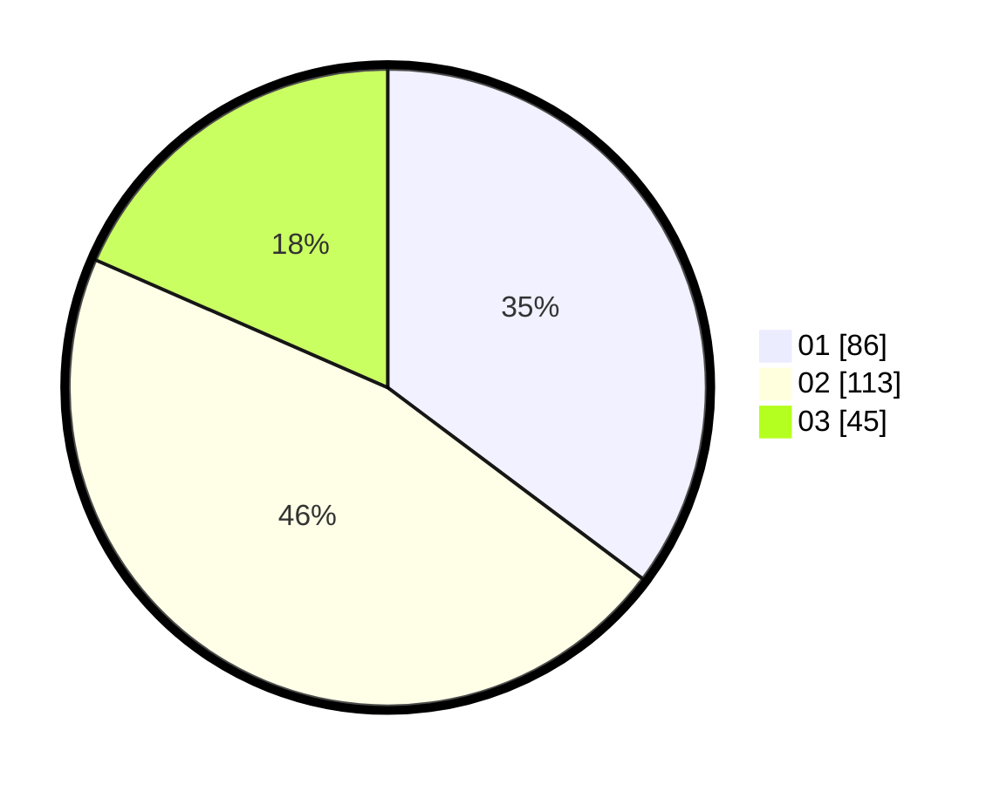

# Hasil

Hasil perolehan suara paslon dapat dilihat pada file paslon-01.txt, paslon-02.txt, dan paslon-03.txt.

Jika tidak ada, artinya data tersebut belum ada pada SIREKAP.

## Perolehan Suara

 * Paslon 01: **86**.
 * Paslon 02: **113**.
 * Paslon 03: **45**.

## Foto C Plano

https://sirekap-obj-formc.kpu.go.id/206c/pemilu/ppwp/31/75/09/10/03/3175091003048-20240214-203858--5cee807e-f307-4243-90f3-712a116445ab.jpg

https://sirekap-obj-formc.kpu.go.id/206c/pemilu/ppwp/31/75/09/10/03/3175091003048-20240214-200150--4ddf7595-8cb2-4c8f-a4e2-34784620139d.jpg

https://sirekap-obj-formc.kpu.go.id/206c/pemilu/ppwp/31/75/09/10/03/3175091003048-20240214-200253--4dcd02da-acf9-45f1-b1fa-f605dcc4a13b.jpg

## DATA PEMILIH TETAP

Jumlah pemilih dalam DPT: **286**.
 * L: **133**.
 * P: **153**.

## DATA PENGGUNA HAK PILIH

Jumlah pengguna hak pilih dalam DPT: **243**.
 * L: **111**.
 * P: **132**.

Jumlah pengguna hak pilih dalam DPTb: **2**.
 * L: **1**.
 * P: **1**.

Jumlah pengguna hak pilih dalam DPK: **5**.
 * L: **2**.
 * P: **3**.

Jumlah pengguna hak pilih: **250**.
 * L: **114**.
 * P: **136**.

## JUMLAH SUARA SAH DAN TIDAK SAH

JUMLAH SELURUH SUARA SAH: **244**.

JUMLAH SUARA TIDAK SAH: **6**.

JUMLAH SELURUH SUARA SAH DAN SUARA TIDAK SAH: **250**.
