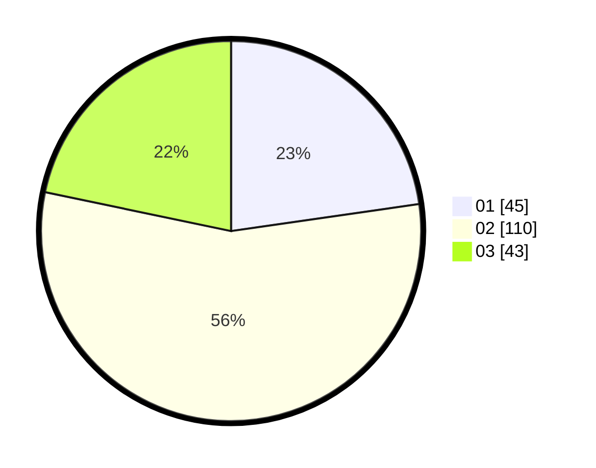

# Hasil

Hasil perolehan suara paslon dapat dilihat pada file paslon-01.txt, paslon-02.txt, dan paslon-03.txt.

Jika tidak ada, artinya data tersebut belum ada pada SIREKAP.

## Perolehan Suara

 * Paslon 01: **45**.
 * Paslon 02: **110**.
 * Paslon 03: **43**.

## Foto C Plano

https://sirekap-obj-formc.kpu.go.id/9711/pemilu/ppwp/31/75/09/10/03/3175091003056-20240214-211351--61f5f483-8b5f-4739-b549-e5bb48854eac.jpg

https://sirekap-obj-formc.kpu.go.id/9711/pemilu/ppwp/31/75/09/10/03/3175091003056-20240214-211610--d5523781-4e18-427b-abf0-d8451787143c.jpg
