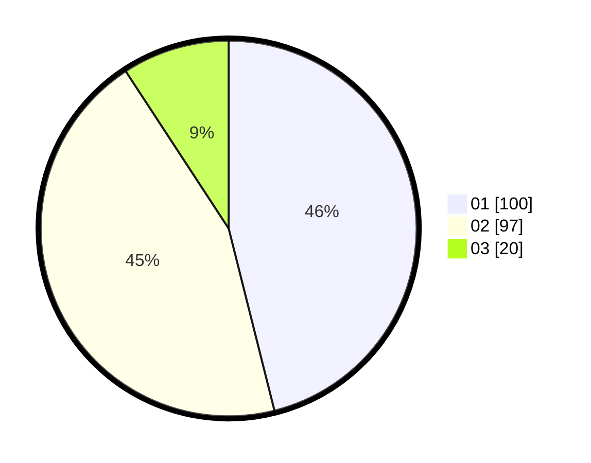

# Hasil

Hasil perolehan suara paslon dapat dilihat pada file paslon-01.txt, paslon-02.txt, dan paslon-03.txt.

Jika tidak ada, artinya data tersebut belum ada pada SIREKAP.

## Perolehan Suara

 * Paslon 01: **100**.
 * Paslon 02: **97**.
 * Paslon 03: **20**.

## Foto C Plano

https://sirekap-obj-formc.kpu.go.id/eada/pemilu/ppwp/31/75/09/10/03/3175091003066-20240214-215229--332607e9-e686-4a81-845a-5943c51251b7.jpg

https://sirekap-obj-formc.kpu.go.id/eada/pemilu/ppwp/31/75/09/10/03/3175091003066-20240214-214241--cdb68573-424b-448d-9554-43eb3bace9fe.jpg

https://sirekap-obj-formc.kpu.go.id/eada/pemilu/ppwp/31/75/09/10/03/3175091003066-20240214-215439--2d7dc6c8-6734-40d3-927d-572b2819dad2.jpg
