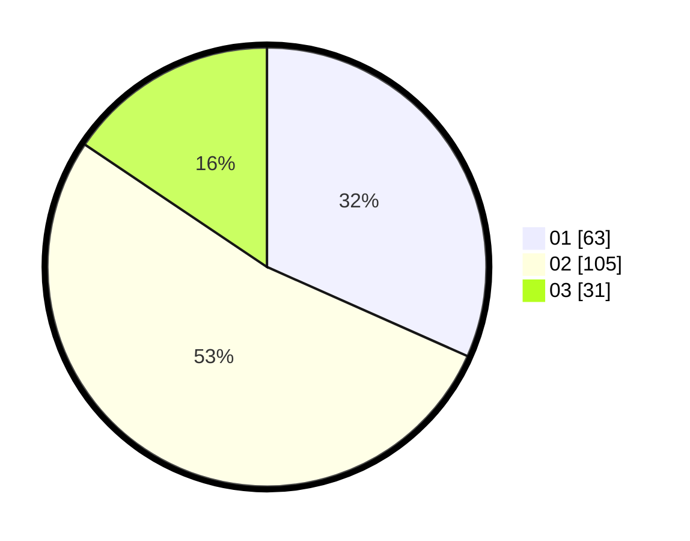

# Hasil

Hasil perolehan suara paslon dapat dilihat pada file paslon-01.txt, paslon-02.txt, dan paslon-03.txt.

Jika tidak ada, artinya data tersebut belum ada pada SIREKAP.

## Perolehan Suara

 * Paslon 01: **63**.
 * Paslon 02: **105**.
 * Paslon 03: **31**.

## Foto C Plano

https://sirekap-obj-formc.kpu.go.id/f89d/pemilu/ppwp/31/75/09/10/03/3175091003073-20240216-142104--32ca52a0-1559-40e4-9bd3-6720b4f50f1c.jpg

https://sirekap-obj-formc.kpu.go.id/f89d/pemilu/ppwp/31/75/09/10/03/3175091003073-20240216-142105--dec630bd-5cf5-4853-ad5c-2b12b817c9a9.jpg

https://sirekap-obj-formc.kpu.go.id/f89d/pemilu/ppwp/31/75/09/10/03/3175091003073-20240216-142105--1021013b-ba47-42f0-94ef-0393ffc6e51d.jpg

## DATA PEMILIH TETAP

Jumlah pemilih dalam DPT: **250**.
 * L: **117**.
 * P: **133**.

## DATA PENGGUNA HAK PILIH

Jumlah pengguna hak pilih dalam DPT: **200**.
 * L: **86**.
 * P: **114**.

Jumlah pengguna hak pilih dalam DPTb: **0**.
 * L: **0**.
 * P: **0**.

Jumlah pengguna hak pilih dalam DPK: **2**.
 * L: **1**.
 * P: **1**.

Jumlah pengguna hak pilih: **202**.
 * L: **87**.
 * P: **115**.

## JUMLAH SUARA SAH DAN TIDAK SAH

JUMLAH SELURUH SUARA SAH: **199**.

JUMLAH SUARA TIDAK SAH: **3**.

JUMLAH SELURUH SUARA SAH DAN SUARA TIDAK SAH: **202**.
