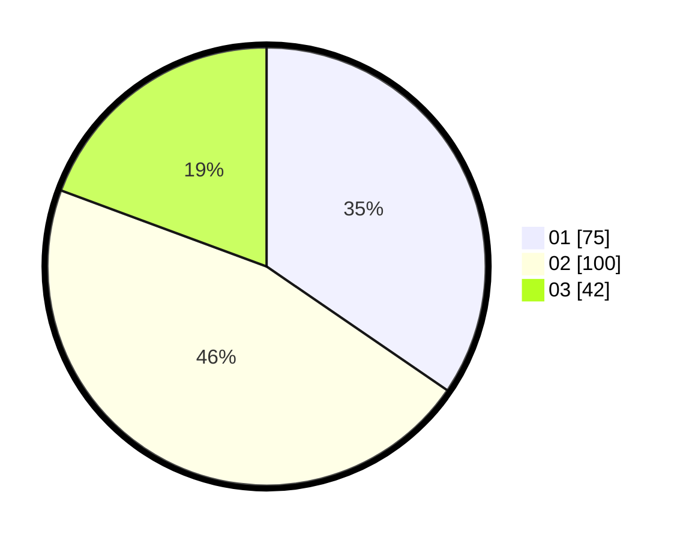

# Hasil

Hasil perolehan suara paslon dapat dilihat pada file paslon-01.txt, paslon-02.txt, dan paslon-03.txt.

Jika tidak ada, artinya data tersebut belum ada pada SIREKAP.

## Perolehan Suara

 * Paslon 01: **75**.
 * Paslon 02: **100**.
 * Paslon 03: **42**.

## Foto C Plano

https://sirekap-obj-formc.kpu.go.id/f371/pemilu/ppwp/31/75/09/10/03/3175091003074-20240214-160115--f16da1b9-4529-4f37-883d-c8ccfd009971.jpg

https://sirekap-obj-formc.kpu.go.id/f371/pemilu/ppwp/31/75/09/10/03/3175091003074-20240214-184616--4049529c-3a5a-44e7-8b9c-0d9cf28fffe5.jpg

https://sirekap-obj-formc.kpu.go.id/f371/pemilu/ppwp/31/75/09/10/03/3175091003074-20240214-184540--d380b986-7bea-40d8-a3be-62053de0152b.jpg

## DATA PEMILIH TETAP

Jumlah pemilih dalam DPT: **251**.
 * L: **126**.
 * P: **125**.

## DATA PENGGUNA HAK PILIH

Jumlah pengguna hak pilih dalam DPT: **218**.
 * L: **108**.
 * P: **110**.

Jumlah pengguna hak pilih dalam DPTb: **0**.
 * L: **0**.
 * P: **0**.

Jumlah pengguna hak pilih dalam DPK: **1**.
 * L: **1**.
 * P: **0**.

Jumlah pengguna hak pilih: **219**.
 * L: **109**.
 * P: **110**.

## JUMLAH SUARA SAH DAN TIDAK SAH

JUMLAH SELURUH SUARA SAH: **217**.

JUMLAH SUARA TIDAK SAH: **2**.

JUMLAH SELURUH SUARA SAH DAN SUARA TIDAK SAH: **219**.
