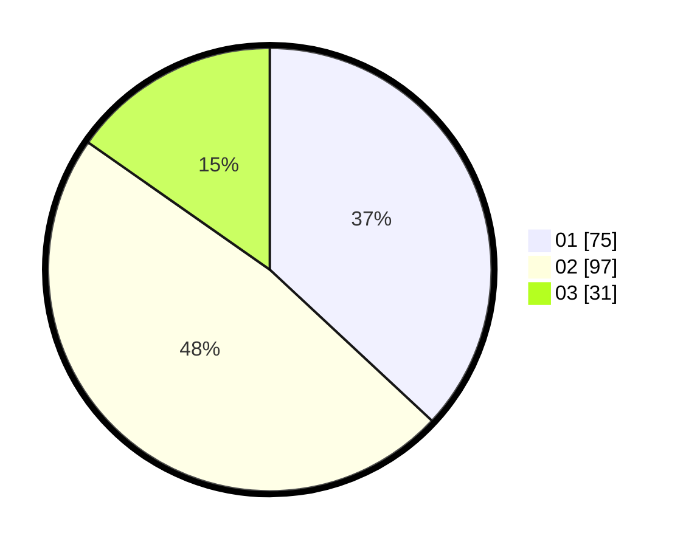

# Hasil

Hasil perolehan suara paslon dapat dilihat pada file paslon-01.txt, paslon-02.txt, dan paslon-03.txt.

Jika tidak ada, artinya data tersebut belum ada pada SIREKAP.

## Perolehan Suara

 * Paslon 01: **75**.
 * Paslon 02: **97**.
 * Paslon 03: **31**.

## Foto C Plano

https://sirekap-obj-formc.kpu.go.id/cd4f/pemilu/ppwp/31/75/09/10/03/3175091003080-20240215-011949--3a9d2316-7fad-4e40-aaba-e9476b9d11a9.jpg

https://sirekap-obj-formc.kpu.go.id/cd4f/pemilu/ppwp/31/75/09/10/03/3175091003080-20240215-012220--e752302c-08f3-4b50-970f-4fc492f6afa5.jpg

https://sirekap-obj-formc.kpu.go.id/cd4f/pemilu/ppwp/31/75/09/10/03/3175091003080-20240215-012343--d139aad1-57cf-4ed5-a954-28b1056ee860.jpg
