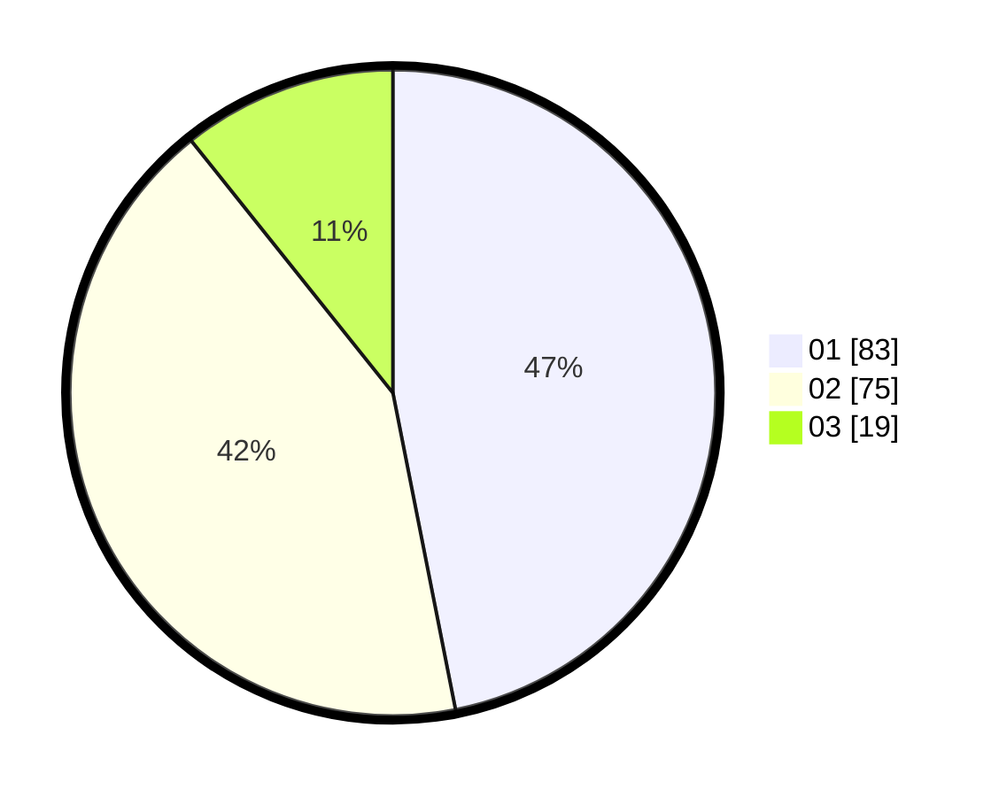

# Hasil

Hasil perolehan suara paslon dapat dilihat pada file paslon-01.txt, paslon-02.txt, dan paslon-03.txt.

Jika tidak ada, artinya data tersebut belum ada pada SIREKAP.

## Perolehan Suara

 * Paslon 01: **83**.
 * Paslon 02: **75**.
 * Paslon 03: **19**.

## Foto C Plano

https://sirekap-obj-formc.kpu.go.id/6353/pemilu/ppwp/31/75/09/10/03/3175091003085-20240214-220211--15695bca-2571-406a-b650-a6e186f863a7.jpg

https://sirekap-obj-formc.kpu.go.id/6353/pemilu/ppwp/31/75/09/10/03/3175091003085-20240214-220706--354f2a15-b196-432e-857a-52444ba4fa69.jpg

https://sirekap-obj-formc.kpu.go.id/6353/pemilu/ppwp/31/75/09/10/03/3175091003085-20240214-220822--bdf92f0b-50c2-4216-b3d6-fd930585685e.jpg
