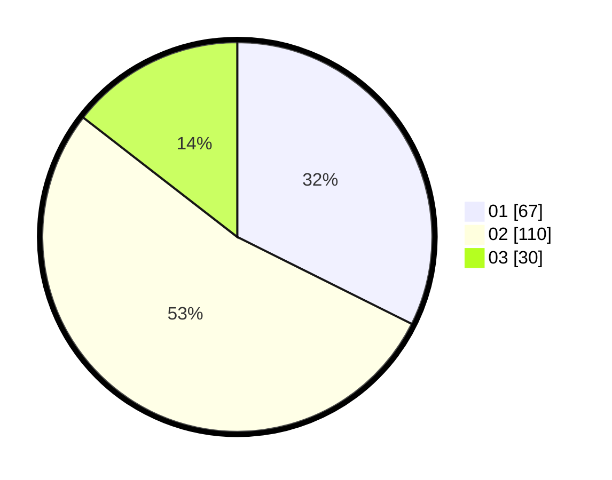

# Hasil

Hasil perolehan suara paslon dapat dilihat pada file paslon-01.txt, paslon-02.txt, dan paslon-03.txt.

Jika tidak ada, artinya data tersebut belum ada pada SIREKAP.

## Perolehan Suara

 * Paslon 01: **67**.
 * Paslon 02: **110**.
 * Paslon 03: **30**.

## Foto C Plano

https://sirekap-obj-formc.kpu.go.id/9fce/pemilu/ppwp/31/75/09/10/03/3175091003088-20240214-220806--e6430a86-f079-4ec5-80a2-c2964d45c1db.jpg

https://sirekap-obj-formc.kpu.go.id/9fce/pemilu/ppwp/31/75/09/10/03/3175091003088-20240214-221001--6f3ccbc7-d1b2-4f3c-a3b0-68e3bcb4929b.jpg

https://sirekap-obj-formc.kpu.go.id/9fce/pemilu/ppwp/31/75/09/10/03/3175091003088-20240214-221233--92478a4d-f5ce-47a9-b1f2-5856b090c64c.jpg

## DATA PEMILIH TETAP

Jumlah pemilih dalam DPT: **268**.
 * L: **125**.
 * P: **143**.

## DATA PENGGUNA HAK PILIH

Jumlah pengguna hak pilih dalam DPT: **203**.
 * L: **92**.
 * P: **111**.

Jumlah pengguna hak pilih dalam DPTb: **2**.
 * L: **0**.
 * P: **2**.

Jumlah pengguna hak pilih dalam DPK: **6**.
 * L: **5**.
 * P: **1**.

Jumlah pengguna hak pilih: **211**.
 * L: **97**.
 * P: **114**.

## JUMLAH SUARA SAH DAN TIDAK SAH

JUMLAH SELURUH SUARA SAH: **207**.

JUMLAH SUARA TIDAK SAH: **4**.

JUMLAH SELURUH SUARA SAH DAN SUARA TIDAK SAH: **211**.
