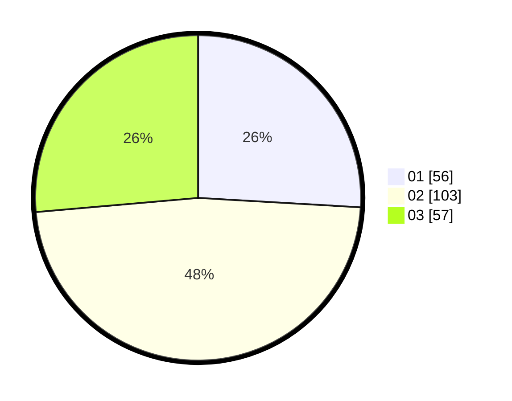

# Hasil

Hasil perolehan suara paslon dapat dilihat pada file paslon-01.txt, paslon-02.txt, dan paslon-03.txt.

Jika tidak ada, artinya data tersebut belum ada pada SIREKAP.

## Perolehan Suara

 * Paslon 01: **56**.
 * Paslon 02: **103**.
 * Paslon 03: **57**.

## Foto C Plano

https://sirekap-obj-formc.kpu.go.id/e2c6/pemilu/ppwp/31/75/09/10/03/3175091003089-20240215-103806--3e2e6d7d-34cb-44a9-992b-4660839b8c33.jpg

https://sirekap-obj-formc.kpu.go.id/e2c6/pemilu/ppwp/31/75/09/10/03/3175091003089-20240215-103913--5bf97383-28ac-4073-9c48-80a6e0b76988.jpg
