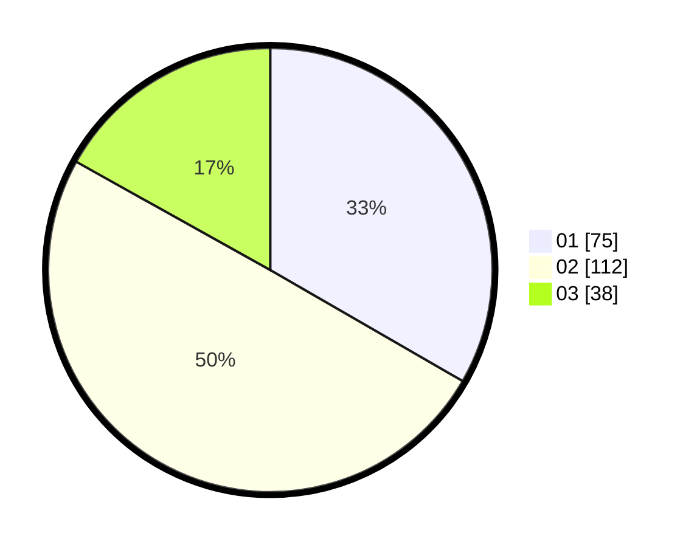

# Hasil

Hasil perolehan suara paslon dapat dilihat pada file paslon-01.txt, paslon-02.txt, dan paslon-03.txt.

Jika tidak ada, artinya data tersebut belum ada pada SIREKAP.

## Perolehan Suara

 * Paslon 01: **75**.
 * Paslon 02: **112**.
 * Paslon 03: **38**.

## Foto C Plano

https://sirekap-obj-formc.kpu.go.id/136f/pemilu/ppwp/31/75/09/10/03/3175091003091-20240215-021416--c60f42a0-08b6-4bea-9db3-9d10f7466262.jpg

https://sirekap-obj-formc.kpu.go.id/136f/pemilu/ppwp/31/75/09/10/03/3175091003091-20240215-021425--17eb8e3f-3eef-4074-be1d-96c7a742b7d8.jpg

https://sirekap-obj-formc.kpu.go.id/136f/pemilu/ppwp/31/75/09/10/03/3175091003091-20240215-021434--35d3bcdb-5182-4059-b9a8-0ee675efdf2f.jpg
