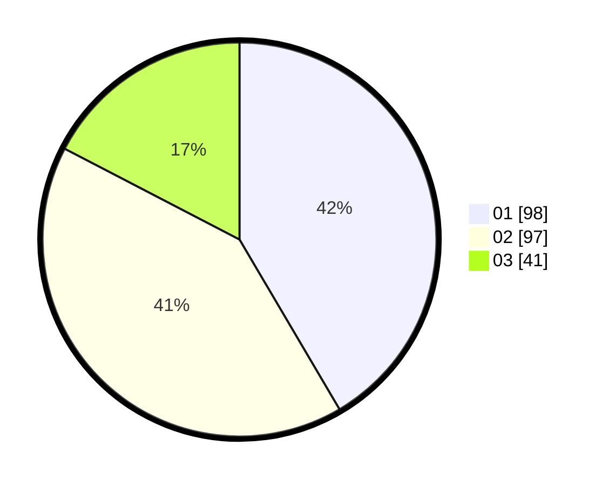

# Hasil

Hasil perolehan suara paslon dapat dilihat pada file paslon-01.txt, paslon-02.txt, dan paslon-03.txt.

Jika tidak ada, artinya data tersebut belum ada pada SIREKAP.

## Perolehan Suara

 * Paslon 01: **98**.
 * Paslon 02: **97**.
 * Paslon 03: **41**.

## Foto C Plano

https://sirekap-obj-formc.kpu.go.id/fbeb/pemilu/ppwp/31/75/09/10/03/3175091003093-20240215-011205--4804d4cd-cb14-4259-9946-237d308b90ea.jpg

https://sirekap-obj-formc.kpu.go.id/fbeb/pemilu/ppwp/31/75/09/10/03/3175091003093-20240215-011250--9f757b98-73ed-404b-ad4f-fb19cc52cae9.jpg

https://sirekap-obj-formc.kpu.go.id/fbeb/pemilu/ppwp/31/75/09/10/03/3175091003093-20240215-011322--8897e3c5-f2b1-4936-b095-39997e2dade5.jpg

## DATA PEMILIH TETAP

Jumlah pemilih dalam DPT: **237**.
 * L: **106**.
 * P: **131**.

## DATA PENGGUNA HAK PILIH

Jumlah pengguna hak pilih dalam DPT: **231**.
 * L: **105**.
 * P: **126**.

Jumlah pengguna hak pilih dalam DPTb: **1**.
 * L: **0**.
 * P: **1**.

Jumlah pengguna hak pilih dalam DPK: **5**.
 * L: **1**.
 * P: **4**.

Jumlah pengguna hak pilih: **237**.
 * L: **106**.
 * P: **131**.

## JUMLAH SUARA SAH DAN TIDAK SAH

JUMLAH SELURUH SUARA SAH: **236**.

JUMLAH SUARA TIDAK SAH: **1**.

JUMLAH SELURUH SUARA SAH DAN SUARA TIDAK SAH: **237**.
