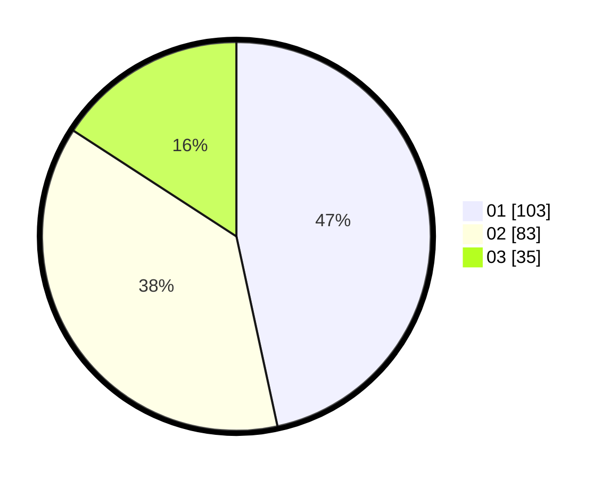

# Hasil

Hasil perolehan suara paslon dapat dilihat pada file paslon-01.txt, paslon-02.txt, dan paslon-03.txt.

Jika tidak ada, artinya data tersebut belum ada pada SIREKAP.

## Perolehan Suara

 * Paslon 01: **103**.
 * Paslon 02: **83**.
 * Paslon 03: **35**.

## Foto C Plano

https://sirekap-obj-formc.kpu.go.id/0743/pemilu/ppwp/31/75/09/10/03/3175091003101-20240214-194223--52fae37e-dc9b-4d70-9fb8-9803cee7af7a.jpg

https://sirekap-obj-formc.kpu.go.id/0743/pemilu/ppwp/31/75/09/10/03/3175091003101-20240214-194315--69b88cf8-2ca5-4aa7-8413-8125f97b2c94.jpg

https://sirekap-obj-formc.kpu.go.id/0743/pemilu/ppwp/31/75/09/10/03/3175091003101-20240214-194358--84efab99-6421-430e-a445-a05621df1df1.jpg

## DATA PEMILIH TETAP

Jumlah pemilih dalam DPT: **257**.
 * L: **118**.
 * P: **139**.

## DATA PENGGUNA HAK PILIH

Jumlah pengguna hak pilih dalam DPT: **216**.
 * L: **96**.
 * P: **120**.

Jumlah pengguna hak pilih dalam DPTb: **2**.
 * L: **1**.
 * P: **1**.

Jumlah pengguna hak pilih dalam DPK: **5**.
 * L: **2**.
 * P: **3**.

Jumlah pengguna hak pilih: **223**.
 * L: **99**.
 * P: **124**.

## JUMLAH SUARA SAH DAN TIDAK SAH

JUMLAH SELURUH SUARA SAH: **221**.

JUMLAH SUARA TIDAK SAH: **2**.

JUMLAH SELURUH SUARA SAH DAN SUARA TIDAK SAH: **223**.
