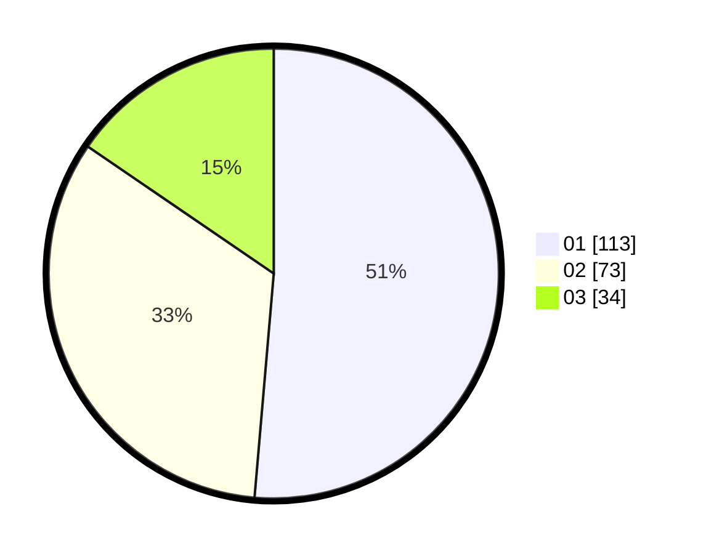

# Hasil

Hasil perolehan suara paslon dapat dilihat pada file paslon-01.txt, paslon-02.txt, dan paslon-03.txt.

Jika tidak ada, artinya data tersebut belum ada pada SIREKAP.

## Perolehan Suara

 * Paslon 01: **113**.
 * Paslon 02: **73**.
 * Paslon 03: **34**.

## Foto C Plano

https://sirekap-obj-formc.kpu.go.id/5342/pemilu/ppwp/31/75/09/10/03/3175091003106-20240216-144001--15b672e1-d4ba-4a80-b85f-2c664369908d.jpg

https://sirekap-obj-formc.kpu.go.id/5342/pemilu/ppwp/31/75/09/10/03/3175091003106-20240216-144002--c12cbfbd-d695-4e01-9856-b44c64722a4f.jpg

https://sirekap-obj-formc.kpu.go.id/5342/pemilu/ppwp/31/75/09/10/03/3175091003106-20240216-144002--3a11688a-5c76-49df-b4e4-de976190e1b1.jpg

## DATA PEMILIH TETAP

Jumlah pemilih dalam DPT: **278**.
 * L: **137**.
 * P: **141**.

## DATA PENGGUNA HAK PILIH

Jumlah pengguna hak pilih dalam DPT: **223**.
 * L: **106**.
 * P: **117**.

Jumlah pengguna hak pilih dalam DPTb: **1**.
 * L: **0**.
 * P: **1**.

Jumlah pengguna hak pilih dalam DPK: **0**.
 * L: **0**.
 * P: **0**.

Jumlah pengguna hak pilih: **224**.
 * L: **106**.
 * P: **118**.

## JUMLAH SUARA SAH DAN TIDAK SAH

JUMLAH SELURUH SUARA SAH: **220**.

JUMLAH SUARA TIDAK SAH: **4**.

JUMLAH SELURUH SUARA SAH DAN SUARA TIDAK SAH: **224**.
