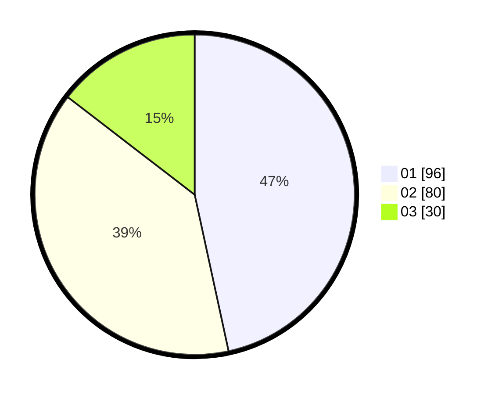

# Hasil

Hasil perolehan suara paslon dapat dilihat pada file paslon-01.txt, paslon-02.txt, dan paslon-03.txt.

Jika tidak ada, artinya data tersebut belum ada pada SIREKAP.

## Perolehan Suara

 * Paslon 01: **96**.
 * Paslon 02: **80**.
 * Paslon 03: **30**.

## Foto C Plano

https://sirekap-obj-formc.kpu.go.id/0443/pemilu/ppwp/31/75/09/10/03/3175091003112-20240214-233002--4ec290f9-0272-46f1-ba2d-9d4db234ff27.jpg

https://sirekap-obj-formc.kpu.go.id/0443/pemilu/ppwp/31/75/09/10/03/3175091003112-20240214-233141--d670d76d-c458-4205-ba5f-17411c9fd9e1.jpg

https://sirekap-obj-formc.kpu.go.id/0443/pemilu/ppwp/31/75/09/10/03/3175091003112-20240214-233237--765e7d4e-ac2c-496f-b4c0-75e20060dbe2.jpg
