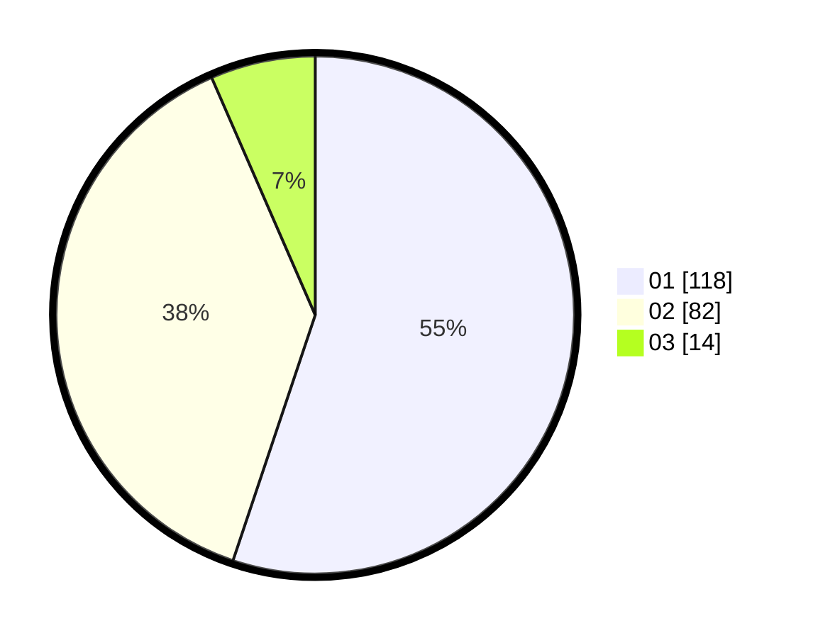

# Hasil

Hasil perolehan suara paslon dapat dilihat pada file paslon-01.txt, paslon-02.txt, dan paslon-03.txt.

Jika tidak ada, artinya data tersebut belum ada pada SIREKAP.

## Perolehan Suara

 * Paslon 01: **118**.
 * Paslon 02: **82**.
 * Paslon 03: **14**.

## Foto C Plano

https://sirekap-obj-formc.kpu.go.id/1631/pemilu/ppwp/31/75/09/10/03/3175091003121-20240214-202130--17ec47e8-fd78-4425-bdb9-54f101610f24.jpg

https://sirekap-obj-formc.kpu.go.id/1631/pemilu/ppwp/31/75/09/10/03/3175091003121-20240214-202134--2a764e92-37a5-4d91-97fa-abd7fc3b96af.jpg

https://sirekap-obj-formc.kpu.go.id/1631/pemilu/ppwp/31/75/09/10/03/3175091003121-20240216-153505--5e91b162-7a55-4a37-b8ca-4b4725aed021.jpg

## DATA PEMILIH TETAP

Jumlah pemilih dalam DPT: **273**.
 * L: **128**.
 * P: **145**.

## DATA PENGGUNA HAK PILIH

Jumlah pengguna hak pilih dalam DPT: **212**.
 * L: **99**.
 * P: **113**.

Jumlah pengguna hak pilih dalam DPTb: **0**.
 * L: **0**.
 * P: **0**.

Jumlah pengguna hak pilih dalam DPK: **4**.
 * L: **1**.
 * P: **3**.

Jumlah pengguna hak pilih: **216**.
 * L: **100**.
 * P: **116**.

## JUMLAH SUARA SAH DAN TIDAK SAH

JUMLAH SELURUH SUARA SAH: **214**.

JUMLAH SUARA TIDAK SAH: **2**.

JUMLAH SELURUH SUARA SAH DAN SUARA TIDAK SAH: **216**.
