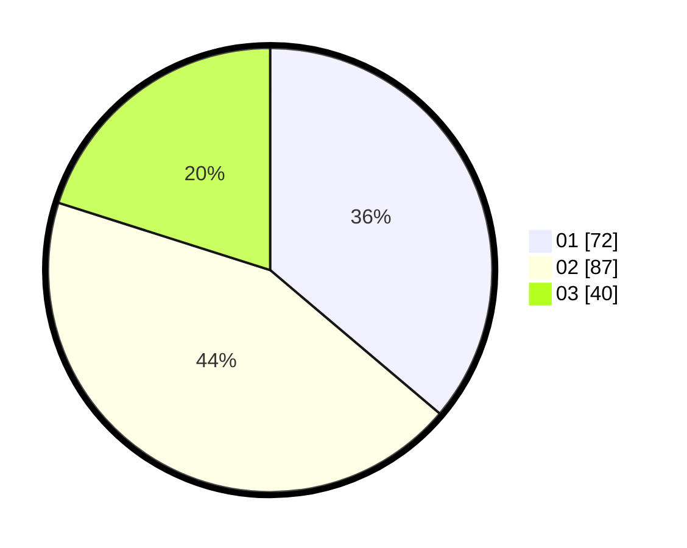

# Hasil

Hasil perolehan suara paslon dapat dilihat pada file paslon-01.txt, paslon-02.txt, dan paslon-03.txt.

Jika tidak ada, artinya data tersebut belum ada pada SIREKAP.

## Perolehan Suara

 * Paslon 01: **72**.
 * Paslon 02: **87**.
 * Paslon 03: **40**.

## Foto C Plano

https://sirekap-obj-formc.kpu.go.id/b4ca/pemilu/ppwp/31/75/09/10/03/3175091003129-20240214-232457--1a0a6cc6-f448-4f64-bfd4-dbcdf2d3e531.jpg

https://sirekap-obj-formc.kpu.go.id/b4ca/pemilu/ppwp/31/75/09/10/03/3175091003129-20240214-232740--6c3ab72f-23c3-4177-84f0-80a496436ac6.jpg

https://sirekap-obj-formc.kpu.go.id/b4ca/pemilu/ppwp/31/75/09/10/03/3175091003129-20240214-233016--1d7109de-5cbc-4136-ae79-2aa13ef593c0.jpg
