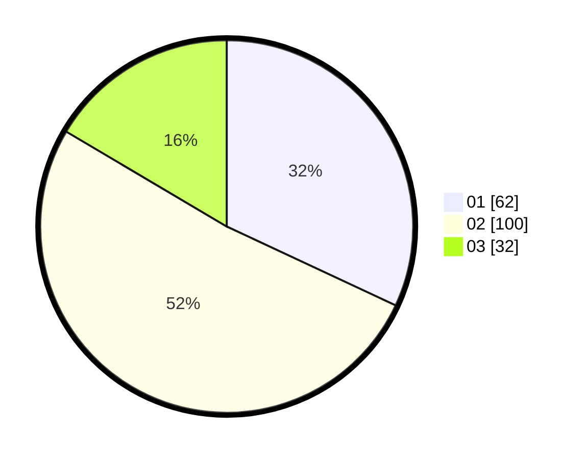

# Hasil

Hasil perolehan suara paslon dapat dilihat pada file paslon-01.txt, paslon-02.txt, dan paslon-03.txt.

Jika tidak ada, artinya data tersebut belum ada pada SIREKAP.

## Perolehan Suara

 * Paslon 01: **62**.
 * Paslon 02: **100**.
 * Paslon 03: **32**.

## Foto C Plano

https://sirekap-obj-formc.kpu.go.id/0ef8/pemilu/ppwp/31/75/09/10/03/3175091003131-20240215-001954--a1f38666-18b9-44ab-9abf-1689ade1eb0e.jpg

https://sirekap-obj-formc.kpu.go.id/0ef8/pemilu/ppwp/31/75/09/10/03/3175091003131-20240215-002021--47344944-8a2d-41c4-a2ea-7fa4402f8d3e.jpg

https://sirekap-obj-formc.kpu.go.id/0ef8/pemilu/ppwp/31/75/09/10/03/3175091003131-20240215-002039--550c6c31-7e97-4802-9c50-d5a316ee569e.jpg

## DATA PEMILIH TETAP

Jumlah pemilih dalam DPT: **262**.
 * L: **122**.
 * P: **140**.

## DATA PENGGUNA HAK PILIH

Jumlah pengguna hak pilih dalam DPT: **194**.
 * L: **88**.
 * P: **106**.

Jumlah pengguna hak pilih dalam DPTb: **1**.
 * L: **1**.
 * P: **0**.

Jumlah pengguna hak pilih dalam DPK: **1**.
 * L: **1**.
 * P: **0**.

Jumlah pengguna hak pilih: **196**.
 * L: **90**.
 * P: **106**.

## JUMLAH SUARA SAH DAN TIDAK SAH

JUMLAH SELURUH SUARA SAH: **194**.

JUMLAH SUARA TIDAK SAH: **2**.

JUMLAH SELURUH SUARA SAH DAN SUARA TIDAK SAH: **196**.
