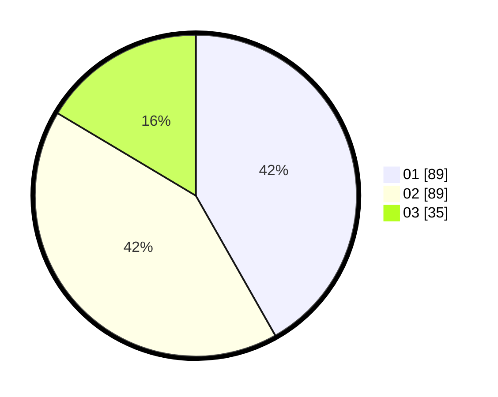

# Hasil

Hasil perolehan suara paslon dapat dilihat pada file paslon-01.txt, paslon-02.txt, dan paslon-03.txt.

Jika tidak ada, artinya data tersebut belum ada pada SIREKAP.

## Perolehan Suara

 * Paslon 01: **89**.
 * Paslon 02: **89**.
 * Paslon 03: **35**.

## Foto C Plano

https://sirekap-obj-formc.kpu.go.id/e417/pemilu/ppwp/31/75/09/10/03/3175091003140-20240214-224113--b5cc16bf-4ee0-4959-b3f6-20b3861c9c6f.jpg

https://sirekap-obj-formc.kpu.go.id/e417/pemilu/ppwp/31/75/09/10/03/3175091003140-20240214-224024--eba6b043-a661-403b-aa18-359919f8880e.jpg
