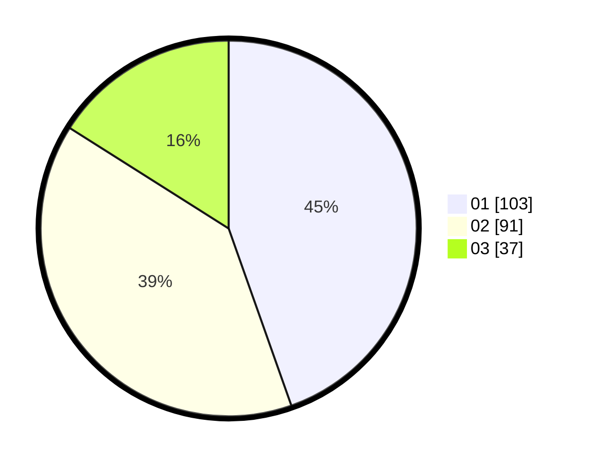

# Hasil

Hasil perolehan suara paslon dapat dilihat pada file paslon-01.txt, paslon-02.txt, dan paslon-03.txt.

Jika tidak ada, artinya data tersebut belum ada pada SIREKAP.

## Perolehan Suara

 * Paslon 01: **103**.
 * Paslon 02: **91**.
 * Paslon 03: **37**.

## Foto C Plano

https://sirekap-obj-formc.kpu.go.id/57bf/pemilu/ppwp/31/75/09/10/03/3175091003146-20240214-160055--41507f70-fbde-45d3-9d2c-25dffa3a3977.jpg

https://sirekap-obj-formc.kpu.go.id/57bf/pemilu/ppwp/31/75/09/10/03/3175091003146-20240214-155229--b397c7c1-15a2-43ce-9e82-1267ec2ff5fb.jpg

https://sirekap-obj-formc.kpu.go.id/57bf/pemilu/ppwp/31/75/09/10/03/3175091003146-20240214-160102--16ff9c12-30e3-4be2-b060-38bed18fc9a2.jpg

## DATA PEMILIH TETAP

Jumlah pemilih dalam DPT: **258**.
 * L: **128**.
 * P: **130**.

## DATA PENGGUNA HAK PILIH

Jumlah pengguna hak pilih dalam DPT: **224**.
 * L: **106**.
 * P: **118**.

Jumlah pengguna hak pilih dalam DPTb: **3**.
 * L: **2**.
 * P: **1**.

Jumlah pengguna hak pilih dalam DPK: **5**.
 * L: **3**.
 * P: **2**.

Jumlah pengguna hak pilih: **232**.
 * L: **111**.
 * P: **121**.

## JUMLAH SUARA SAH DAN TIDAK SAH

JUMLAH SELURUH SUARA SAH: **231**.

JUMLAH SUARA TIDAK SAH: **1**.

JUMLAH SELURUH SUARA SAH DAN SUARA TIDAK SAH: **232**.
