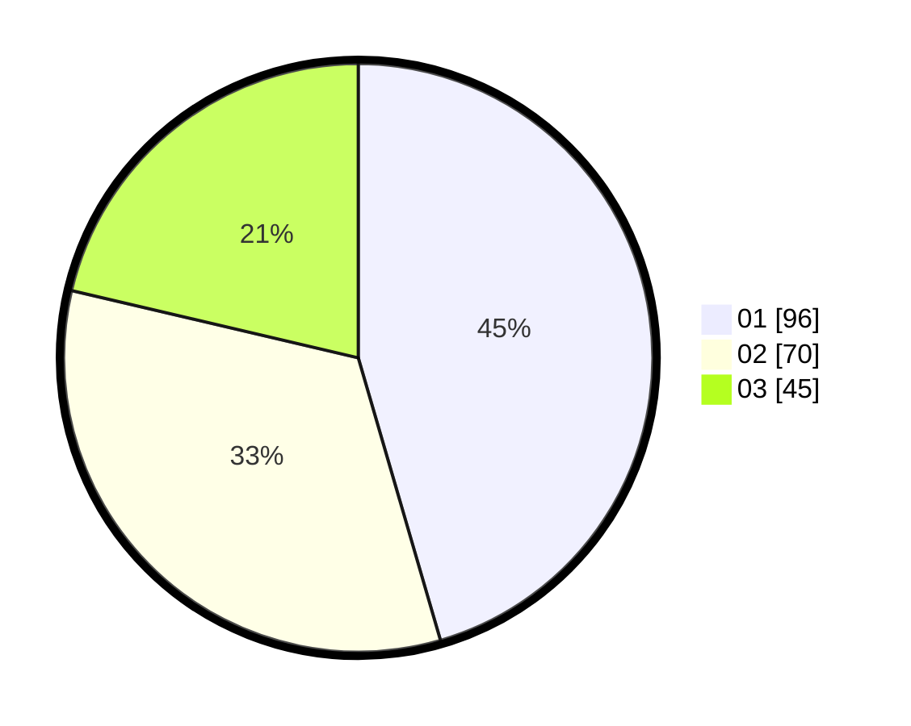

# Hasil

Hasil perolehan suara paslon dapat dilihat pada file paslon-01.txt, paslon-02.txt, dan paslon-03.txt.

Jika tidak ada, artinya data tersebut belum ada pada SIREKAP.

## Perolehan Suara

 * Paslon 01: **96**.
 * Paslon 02: **70**.
 * Paslon 03: **45**.

## Foto C Plano

https://sirekap-obj-formc.kpu.go.id/ec0b/pemilu/ppwp/31/75/09/10/03/3175091003147-20240214-194755--f4071182-007d-4553-9cf6-3787d8deaab8.jpg

https://sirekap-obj-formc.kpu.go.id/ec0b/pemilu/ppwp/31/75/09/10/03/3175091003147-20240214-194830--61cdda70-5120-49fb-871f-3f9ead0764ae.jpg

https://sirekap-obj-formc.kpu.go.id/ec0b/pemilu/ppwp/31/75/09/10/03/3175091003147-20240214-194927--ccae7f68-0266-483e-8acd-4b1c116c67b8.jpg
