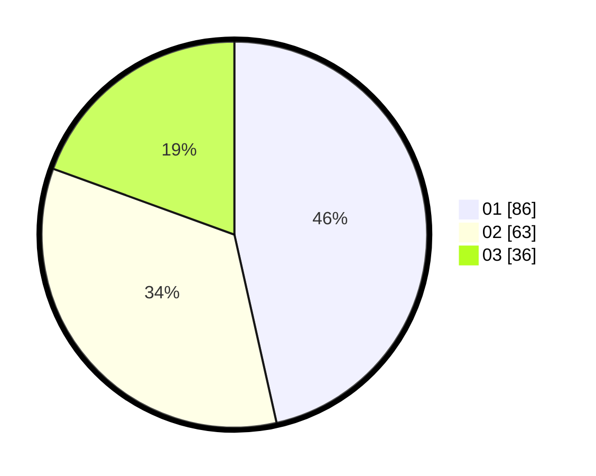

# Hasil

Hasil perolehan suara paslon dapat dilihat pada file paslon-01.txt, paslon-02.txt, dan paslon-03.txt.

Jika tidak ada, artinya data tersebut belum ada pada SIREKAP.

## Perolehan Suara

 * Paslon 01: **86**.
 * Paslon 02: **63**.
 * Paslon 03: **36**.

## Foto C Plano

https://sirekap-obj-formc.kpu.go.id/61c3/pemilu/ppwp/31/75/09/10/03/3175091003149-20240214-193630--830bc7eb-b082-4808-9e1d-0ae437910cb2.jpg

https://sirekap-obj-formc.kpu.go.id/61c3/pemilu/ppwp/31/75/09/10/03/3175091003149-20240214-193633--ecc2894e-8d06-4004-a62a-d22763487f86.jpg

https://sirekap-obj-formc.kpu.go.id/61c3/pemilu/ppwp/31/75/09/10/03/3175091003149-20240214-193636--fd41225d-31b5-436c-bc32-bd0917584f55.jpg

## DATA PEMILIH TETAP

Jumlah pemilih dalam DPT: **245**.
 * L: **118**.
 * P: **127**.

## DATA PENGGUNA HAK PILIH

Jumlah pengguna hak pilih dalam DPT: **186**.
 * L: **91**.
 * P: **95**.

Jumlah pengguna hak pilih dalam DPTb: **2**.
 * L: **1**.
 * P: **1**.

Jumlah pengguna hak pilih dalam DPK: **2**.
 * L: **1**.
 * P: **1**.

Jumlah pengguna hak pilih: **190**.
 * L: **93**.
 * P: **97**.

## JUMLAH SUARA SAH DAN TIDAK SAH

JUMLAH SELURUH SUARA SAH: **185**.

JUMLAH SUARA TIDAK SAH: **5**.

JUMLAH SELURUH SUARA SAH DAN SUARA TIDAK SAH: **190**.
