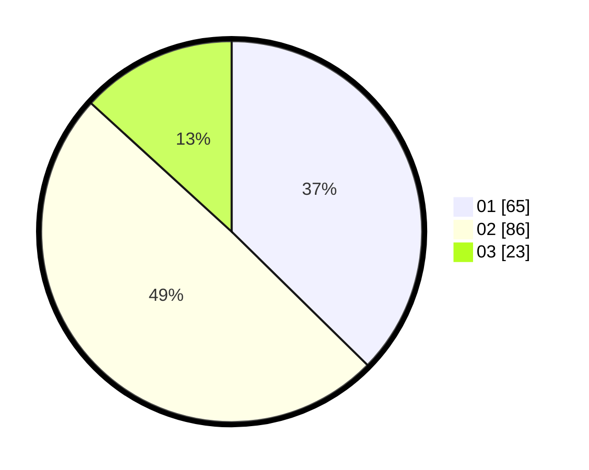

# Hasil

Hasil perolehan suara paslon dapat dilihat pada file paslon-01.txt, paslon-02.txt, dan paslon-03.txt.

Jika tidak ada, artinya data tersebut belum ada pada SIREKAP.

## Perolehan Suara

 * Paslon 01: **65**.
 * Paslon 02: **86**.
 * Paslon 03: **23**.

## Foto C Plano

https://sirekap-obj-formc.kpu.go.id/6f27/pemilu/ppwp/31/75/09/10/03/3175091003152-20240214-155727--3e370ee3-5ed2-47bf-9219-cd6f7f5b8b21.jpg

https://sirekap-obj-formc.kpu.go.id/6f27/pemilu/ppwp/31/75/09/10/03/3175091003152-20240214-155804--9db6887a-4544-45c0-90d7-f019b0b2f564.jpg

https://sirekap-obj-formc.kpu.go.id/6f27/pemilu/ppwp/31/75/09/10/03/3175091003152-20240214-155902--d5a63ed5-011a-461f-af5c-bd286e02cafe.jpg

## DATA PEMILIH TETAP

Jumlah pemilih dalam DPT: **252**.
 * L: **125**.
 * P: **127**.

## DATA PENGGUNA HAK PILIH

Jumlah pengguna hak pilih dalam DPT: **172**.
 * L: **81**.
 * P: **91**.

Jumlah pengguna hak pilih dalam DPTb: **1**.
 * L: **0**.
 * P: **1**.

Jumlah pengguna hak pilih dalam DPK: **1**.
 * L: **0**.
 * P: **1**.

Jumlah pengguna hak pilih: **174**.
 * L: **81**.
 * P: **93**.

## JUMLAH SUARA SAH DAN TIDAK SAH

JUMLAH SELURUH SUARA SAH: **174**.

JUMLAH SUARA TIDAK SAH: **0**.

JUMLAH SELURUH SUARA SAH DAN SUARA TIDAK SAH: **174**.
