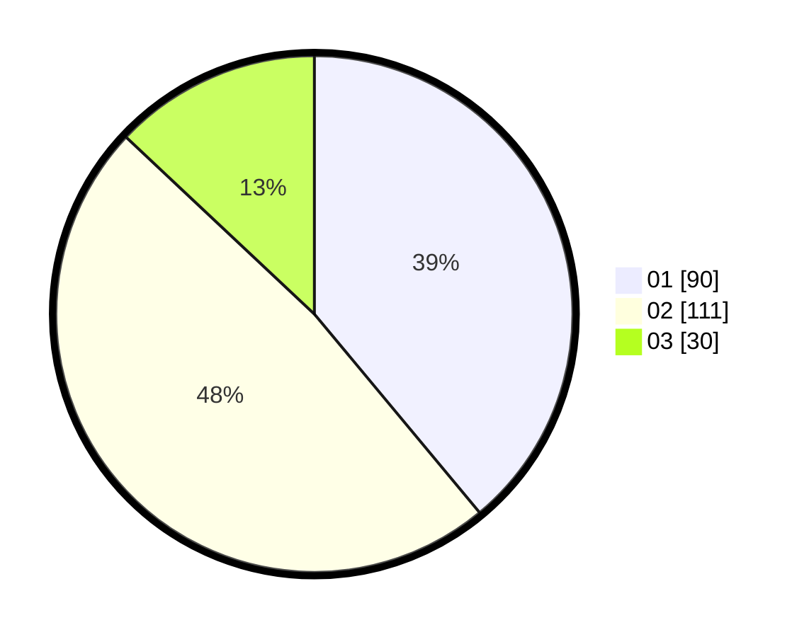

# Hasil

Hasil perolehan suara paslon dapat dilihat pada file paslon-01.txt, paslon-02.txt, dan paslon-03.txt.

Jika tidak ada, artinya data tersebut belum ada pada SIREKAP.

## Perolehan Suara

 * Paslon 01: **90**.
 * Paslon 02: **111**.
 * Paslon 03: **30**.

## Foto C Plano

https://sirekap-obj-formc.kpu.go.id/eafa/pemilu/ppwp/31/75/09/10/03/3175091003159-20240214-204925--d7a5bfeb-cfc8-4f1d-bf52-072f00d84a3f.jpg

https://sirekap-obj-formc.kpu.go.id/eafa/pemilu/ppwp/31/75/09/10/03/3175091003159-20240214-204946--85e208d2-fbcd-432a-956a-af033abd44d7.jpg

https://sirekap-obj-formc.kpu.go.id/eafa/pemilu/ppwp/31/75/09/10/03/3175091003159-20240214-233303--923873c0-ed9a-4321-9b5b-1e666c63dc21.jpg
