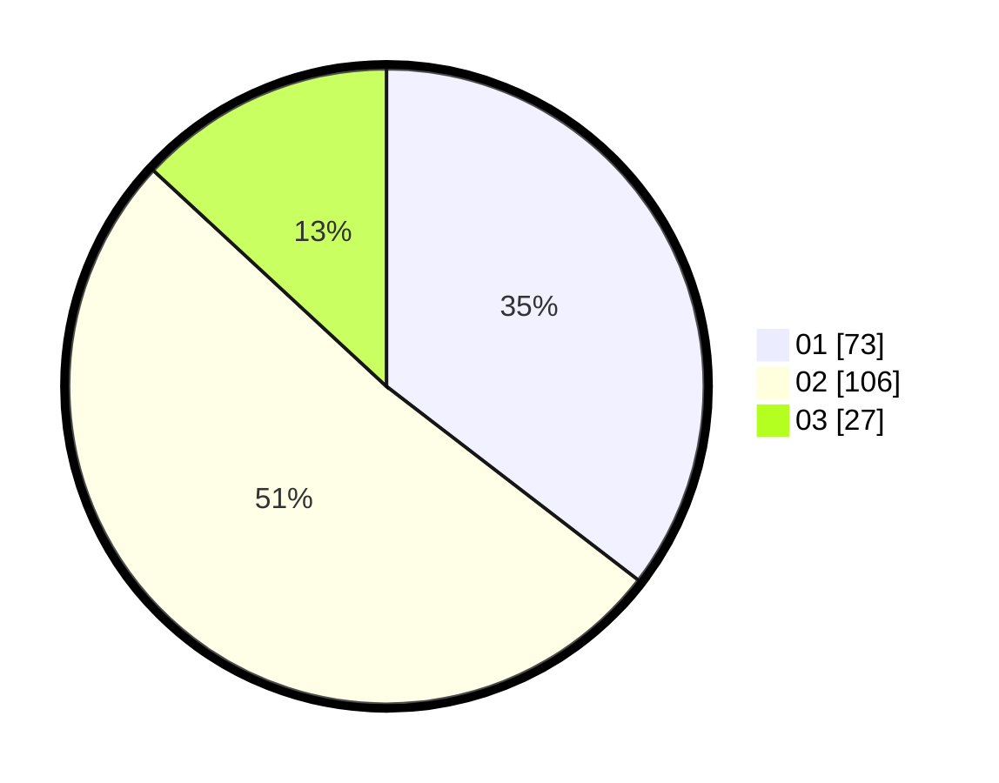

# Hasil

Hasil perolehan suara paslon dapat dilihat pada file paslon-01.txt, paslon-02.txt, dan paslon-03.txt.

Jika tidak ada, artinya data tersebut belum ada pada SIREKAP.

## Perolehan Suara

 * Paslon 01: **73**.
 * Paslon 02: **106**.
 * Paslon 03: **27**.

## Foto C Plano

https://sirekap-obj-formc.kpu.go.id/e70d/pemilu/ppwp/31/75/09/10/03/3175091003162-20240214-200655--ab1be1c7-9517-44cf-b653-9c0b8d2292f4.jpg

https://sirekap-obj-formc.kpu.go.id/e70d/pemilu/ppwp/31/75/09/10/03/3175091003162-20240214-200711--6ab2d7c8-9bd8-4a2e-85dd-cd61b859651e.jpg

https://sirekap-obj-formc.kpu.go.id/e70d/pemilu/ppwp/31/75/09/10/03/3175091003162-20240214-200726--c02078a7-731f-40f8-93cd-7126ba6692c8.jpg

## DATA PEMILIH TETAP

Jumlah pemilih dalam DPT: **273**.
 * L: **137**.
 * P: **137**.

## DATA PENGGUNA HAK PILIH

Jumlah pengguna hak pilih dalam DPT: **210**.
 * L: **101**.
 * P: **109**.

Jumlah pengguna hak pilih dalam DPTb: **1**.
 * L: **0**.
 * P: **1**.

Jumlah pengguna hak pilih dalam DPK: **1**.
 * L: **0**.
 * P: **1**.

Jumlah pengguna hak pilih: **212**.
 * L: **101**.
 * P: **111**.

## JUMLAH SUARA SAH DAN TIDAK SAH

JUMLAH SELURUH SUARA SAH: **206**.

JUMLAH SUARA TIDAK SAH: **6**.

JUMLAH SELURUH SUARA SAH DAN SUARA TIDAK SAH: **212**.
