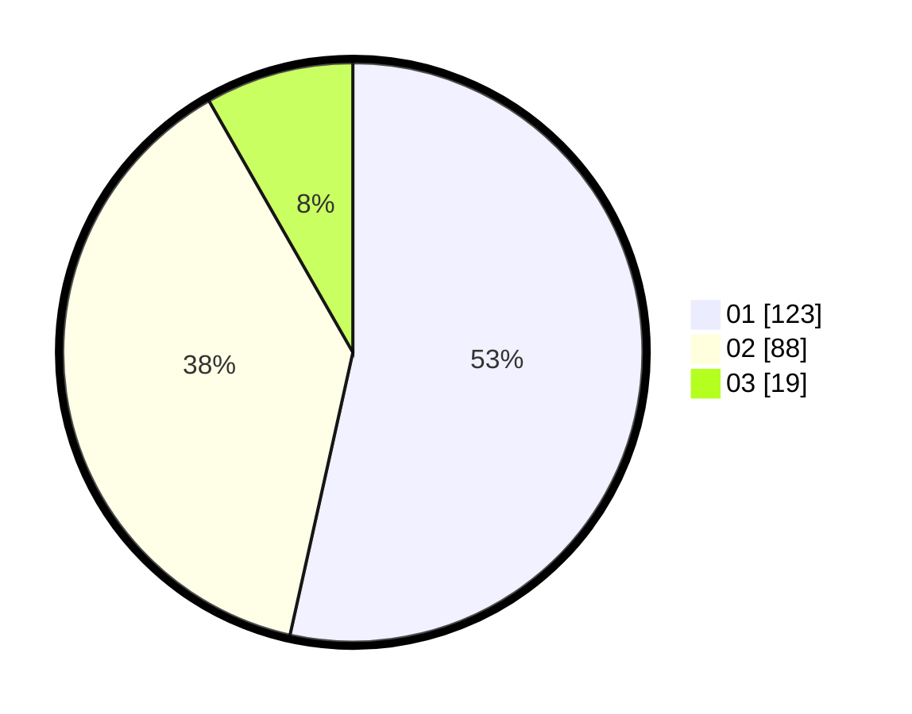

# Hasil

Hasil perolehan suara paslon dapat dilihat pada file paslon-01.txt, paslon-02.txt, dan paslon-03.txt.

Jika tidak ada, artinya data tersebut belum ada pada SIREKAP.

## Perolehan Suara

 * Paslon 01: **123**.
 * Paslon 02: **88**.
 * Paslon 03: **19**.

## Foto C Plano

https://sirekap-obj-formc.kpu.go.id/87c6/pemilu/ppwp/31/75/09/10/04/3175091004003-20240215-222125--1dfaf20a-77eb-4098-b16a-1d11732085b8.jpg

https://sirekap-obj-formc.kpu.go.id/87c6/pemilu/ppwp/31/75/09/10/04/3175091004003-20240215-222128--9ece0b41-6d79-4c67-a8c0-680ad6b74ec4.jpg

https://sirekap-obj-formc.kpu.go.id/87c6/pemilu/ppwp/31/75/09/10/04/3175091004003-20240215-222127--7b264b16-27f0-424e-9c6d-98eec39dc54b.jpg

## DATA PEMILIH TETAP

Jumlah pemilih dalam DPT: **285**.
 * L: **150**.
 * P: **135**.

## DATA PENGGUNA HAK PILIH

Jumlah pengguna hak pilih dalam DPT: **232**.
 * L: **121**.
 * P: **111**.

Jumlah pengguna hak pilih dalam DPTb: **0**.
 * L: **0**.
 * P: **0**.

Jumlah pengguna hak pilih dalam DPK: **1**.
 * L: **0**.
 * P: **1**.

Jumlah pengguna hak pilih: **233**.
 * L: **121**.
 * P: **112**.

## JUMLAH SUARA SAH DAN TIDAK SAH

JUMLAH SELURUH SUARA SAH: **230**.

JUMLAH SUARA TIDAK SAH: **3**.

JUMLAH SELURUH SUARA SAH DAN SUARA TIDAK SAH: **233**.
