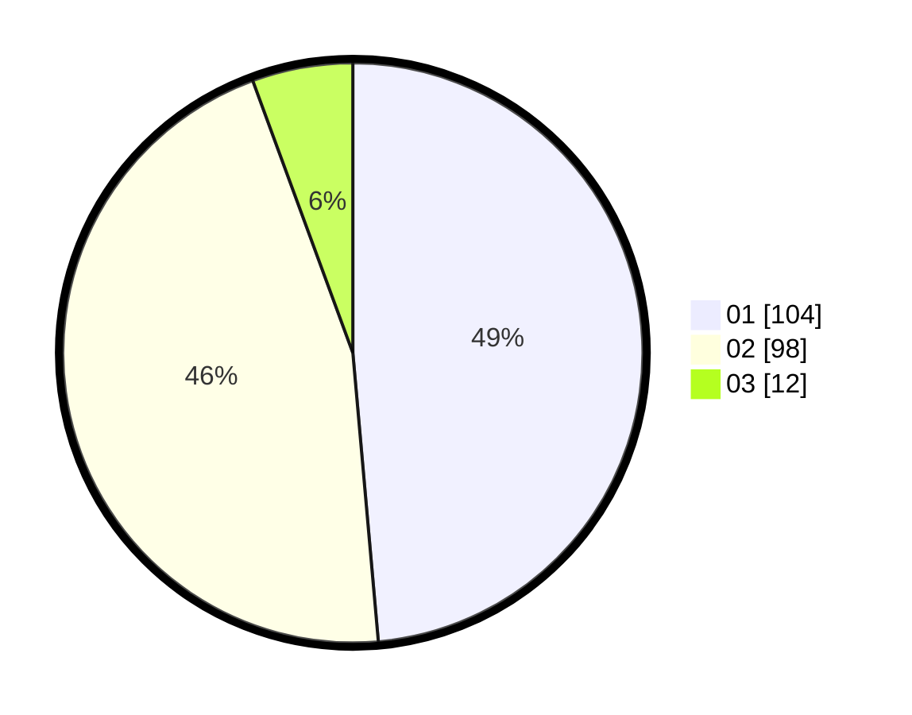

# Hasil

Hasil perolehan suara paslon dapat dilihat pada file paslon-01.txt, paslon-02.txt, dan paslon-03.txt.

Jika tidak ada, artinya data tersebut belum ada pada SIREKAP.

## Perolehan Suara

 * Paslon 01: **104**.
 * Paslon 02: **98**.
 * Paslon 03: **12**.

## Foto C Plano

https://sirekap-obj-formc.kpu.go.id/ab00/pemilu/ppwp/31/75/09/10/04/3175091004005-20240216-195632--c9632d06-e560-4f0a-a4a0-340b9b586d47.jpg

https://sirekap-obj-formc.kpu.go.id/ab00/pemilu/ppwp/31/75/09/10/04/3175091004005-20240216-195734--a5d7ea1f-baee-4ee8-9368-c24ef08b5265.jpg

https://sirekap-obj-formc.kpu.go.id/ab00/pemilu/ppwp/31/75/09/10/04/3175091004005-20240216-195709--208f349c-b9aa-412f-8b64-fb59794ca4c6.jpg

## DATA PEMILIH TETAP

Jumlah pemilih dalam DPT: **271**.
 * L: **172**.
 * P: **139**.

## DATA PENGGUNA HAK PILIH

Jumlah pengguna hak pilih dalam DPT: **205**.
 * L: **91**.
 * P: **115**.

Jumlah pengguna hak pilih dalam DPTb: **10**.
 * L: **7**.
 * P: **703**.

Jumlah pengguna hak pilih dalam DPK: **0**.
 * L: **0**.
 * P: **8**.

Jumlah pengguna hak pilih: **215**.
 * L: **98**.
 * P: **114**.

## JUMLAH SUARA SAH DAN TIDAK SAH

JUMLAH SELURUH SUARA SAH: **214**.

JUMLAH SUARA TIDAK SAH: **2**.

JUMLAH SELURUH SUARA SAH DAN SUARA TIDAK SAH: **216**.
