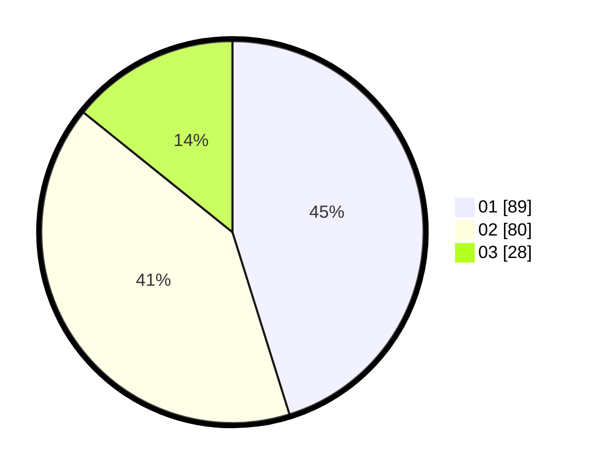

# Hasil

Hasil perolehan suara paslon dapat dilihat pada file paslon-01.txt, paslon-02.txt, dan paslon-03.txt.

Jika tidak ada, artinya data tersebut belum ada pada SIREKAP.

## Perolehan Suara

 * Paslon 01: **89**.
 * Paslon 02: **80**.
 * Paslon 03: **28**.

## Foto C Plano

https://sirekap-obj-formc.kpu.go.id/b406/pemilu/ppwp/31/75/09/10/04/3175091004017-20240214-215842--4fb7b8e9-0270-4e61-ad57-29cb83182a73.jpg

https://sirekap-obj-formc.kpu.go.id/b406/pemilu/ppwp/31/75/09/10/04/3175091004017-20240214-215930--07886ee7-8f5d-476a-a430-a7c479d16566.jpg

https://sirekap-obj-formc.kpu.go.id/b406/pemilu/ppwp/31/75/09/10/04/3175091004017-20240214-220036--28f3f22e-b3a2-44c2-b440-0dfc47ef3072.jpg

## DATA PEMILIH TETAP

Jumlah pemilih dalam DPT: **275**.
 * L: **143**.
 * P: **132**.

## DATA PENGGUNA HAK PILIH

Jumlah pengguna hak pilih dalam DPT: **198**.
 * L: **100**.
 * P: **98**.

Jumlah pengguna hak pilih dalam DPTb: **0**.
 * L: **0**.
 * P: **0**.

Jumlah pengguna hak pilih dalam DPK: **2**.
 * L: **1**.
 * P: **1**.

Jumlah pengguna hak pilih: **200**.
 * L: **101**.
 * P: **99**.

## JUMLAH SUARA SAH DAN TIDAK SAH

JUMLAH SELURUH SUARA SAH: **197**.

JUMLAH SUARA TIDAK SAH: **3**.

JUMLAH SELURUH SUARA SAH DAN SUARA TIDAK SAH: **200**.
