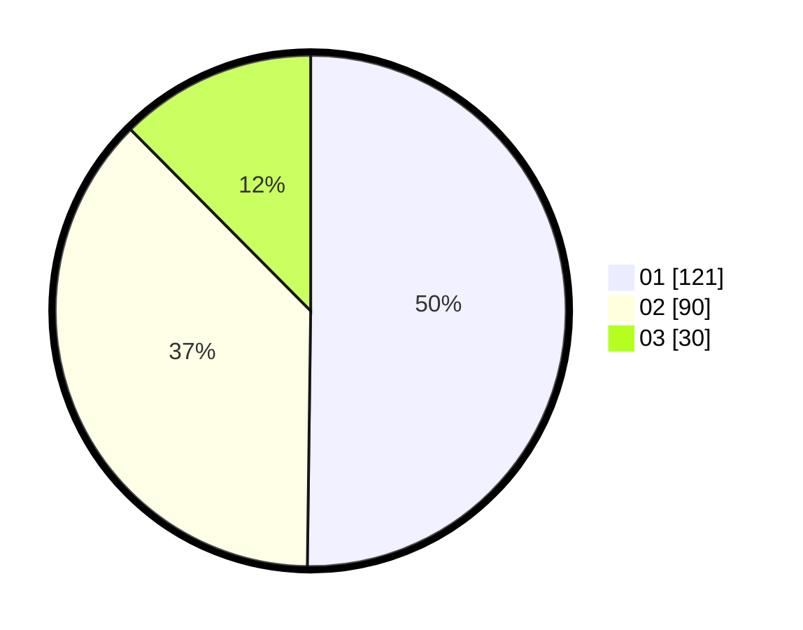

# Hasil

Hasil perolehan suara paslon dapat dilihat pada file paslon-01.txt, paslon-02.txt, dan paslon-03.txt.

Jika tidak ada, artinya data tersebut belum ada pada SIREKAP.

## Perolehan Suara

 * Paslon 01: **121**.
 * Paslon 02: **90**.
 * Paslon 03: **30**.

## Foto C Plano

https://sirekap-obj-formc.kpu.go.id/702b/pemilu/ppwp/31/75/09/10/04/3175091004019-20240216-015007--50cf9b99-f916-4166-880f-67fb51a33062.jpg

https://sirekap-obj-formc.kpu.go.id/702b/pemilu/ppwp/31/75/09/10/04/3175091004019-20240216-015009--dc12cbe9-57c7-448a-9c7d-8d95296feb5d.jpg

https://sirekap-obj-formc.kpu.go.id/702b/pemilu/ppwp/31/75/09/10/04/3175091004019-20240216-015008--78c00d05-855b-4377-a259-e60da2f0dadb.jpg

## DATA PEMILIH TETAP

Jumlah pemilih dalam DPT: **274**.
 * L: **141**.
 * P: **133**.

## DATA PENGGUNA HAK PILIH

Jumlah pengguna hak pilih dalam DPT: **235**.
 * L: **119**.
 * P: **116**.

Jumlah pengguna hak pilih dalam DPTb: **0**.
 * L: **0**.
 * P: **0**.

Jumlah pengguna hak pilih dalam DPK: **6**.
 * L: **4**.
 * P: **2**.

Jumlah pengguna hak pilih: **241**.
 * L: **123**.
 * P: **118**.

## JUMLAH SUARA SAH DAN TIDAK SAH

JUMLAH SELURUH SUARA SAH: **241**.

JUMLAH SUARA TIDAK SAH: **0**.

JUMLAH SELURUH SUARA SAH DAN SUARA TIDAK SAH: **241**.
