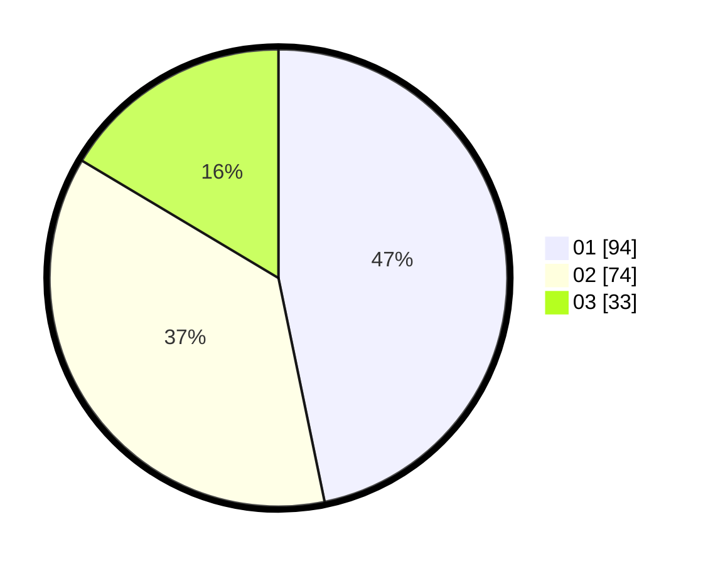

# Hasil

Hasil perolehan suara paslon dapat dilihat pada file paslon-01.txt, paslon-02.txt, dan paslon-03.txt.

Jika tidak ada, artinya data tersebut belum ada pada SIREKAP.

## Perolehan Suara

 * Paslon 01: **94**.
 * Paslon 02: **74**.
 * Paslon 03: **33**.

## Foto C Plano

https://sirekap-obj-formc.kpu.go.id/bcee/pemilu/ppwp/31/75/09/10/04/3175091004027-20240214-155508--8641ccc3-8ed6-444a-bd41-5938067d4a0e.jpg

https://sirekap-obj-formc.kpu.go.id/bcee/pemilu/ppwp/31/75/09/10/04/3175091004027-20240214-155248--2f714eb1-4b50-40a6-a3e9-7e1963c37aa5.jpg

https://sirekap-obj-formc.kpu.go.id/bcee/pemilu/ppwp/31/75/09/10/04/3175091004027-20240214-155409--f0f1a6dd-0194-47b0-821a-2d1a16fbf11b.jpg

## DATA PEMILIH TETAP

Jumlah pemilih dalam DPT: **287**.
 * L: **158**.
 * P: **129**.

## DATA PENGGUNA HAK PILIH

Jumlah pengguna hak pilih dalam DPT: **202**.
 * L: **106**.
 * P: **96**.

Jumlah pengguna hak pilih dalam DPTb: **0**.
 * L: **0**.
 * P: **0**.

Jumlah pengguna hak pilih dalam DPK: **2**.
 * L: **0**.
 * P: **2**.

Jumlah pengguna hak pilih: **204**.
 * L: **106**.
 * P: **98**.

## JUMLAH SUARA SAH DAN TIDAK SAH

JUMLAH SELURUH SUARA SAH: **201**.

JUMLAH SUARA TIDAK SAH: **3**.

JUMLAH SELURUH SUARA SAH DAN SUARA TIDAK SAH: **204**.
