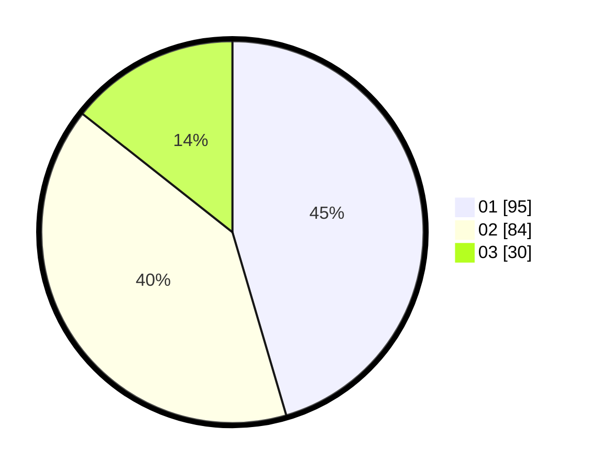

# Hasil

Hasil perolehan suara paslon dapat dilihat pada file paslon-01.txt, paslon-02.txt, dan paslon-03.txt.

Jika tidak ada, artinya data tersebut belum ada pada SIREKAP.

## Perolehan Suara

 * Paslon 01: **95**.
 * Paslon 02: **84**.
 * Paslon 03: **30**.

## Foto C Plano

https://sirekap-obj-formc.kpu.go.id/7dd8/pemilu/ppwp/31/75/09/10/04/3175091004029-20240216-153753--22ade5e5-4940-4f6d-a6f9-f4b4027aab71.jpg

https://sirekap-obj-formc.kpu.go.id/7dd8/pemilu/ppwp/31/75/09/10/04/3175091004029-20240216-153755--0c05a37c-03c4-4690-b553-998cde15dab1.jpg

https://sirekap-obj-formc.kpu.go.id/7dd8/pemilu/ppwp/31/75/09/10/04/3175091004029-20240216-153754--f48753c0-fba3-43ec-bcb6-36b587caf6c7.jpg

## DATA PEMILIH TETAP

Jumlah pemilih dalam DPT: **260**.
 * L: **138**.
 * P: **122**.

## DATA PENGGUNA HAK PILIH

Jumlah pengguna hak pilih dalam DPT: **211**.
 * L: **108**.
 * P: **103**.

Jumlah pengguna hak pilih dalam DPTb: **0**.
 * L: **0**.
 * P: **0**.

Jumlah pengguna hak pilih dalam DPK: **0**.
 * L: **0**.
 * P: **0**.

Jumlah pengguna hak pilih: **211**.
 * L: **108**.
 * P: **103**.

## JUMLAH SUARA SAH DAN TIDAK SAH

JUMLAH SELURUH SUARA SAH: **209**.

JUMLAH SUARA TIDAK SAH: **2**.

JUMLAH SELURUH SUARA SAH DAN SUARA TIDAK SAH: **211**.
