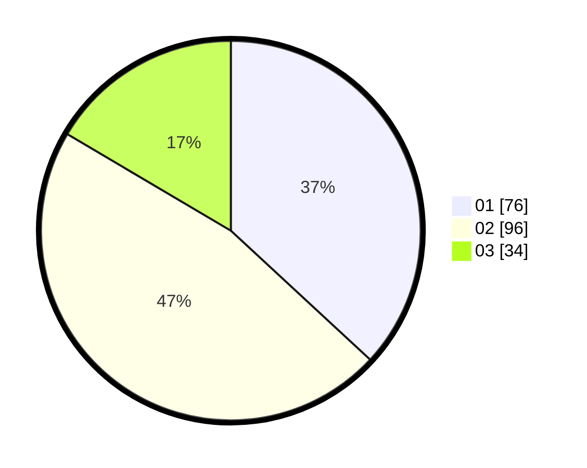

# Hasil

Hasil perolehan suara paslon dapat dilihat pada file paslon-01.txt, paslon-02.txt, dan paslon-03.txt.

Jika tidak ada, artinya data tersebut belum ada pada SIREKAP.

## Perolehan Suara

 * Paslon 01: **76**.
 * Paslon 02: **96**.
 * Paslon 03: **34**.

## Foto C Plano

https://sirekap-obj-formc.kpu.go.id/f489/pemilu/ppwp/31/75/09/10/04/3175091004036-20240217-202603--c32bf837-008e-41fd-9a60-7f7ef50fbde0.jpg

https://sirekap-obj-formc.kpu.go.id/f489/pemilu/ppwp/31/75/09/10/04/3175091004036-20240217-202605--d6899914-b527-4370-b14b-529411a1b2a1.jpg

https://sirekap-obj-formc.kpu.go.id/f489/pemilu/ppwp/31/75/09/10/04/3175091004036-20240217-202604--2b0091b1-9118-4c10-9263-674f8d6ac581.jpg

## DATA PEMILIH TETAP

Jumlah pemilih dalam DPT: **208**.
 * L: **101**.
 * P: **107**.

## DATA PENGGUNA HAK PILIH

Jumlah pengguna hak pilih dalam DPT: **208**.
 * L: **101**.
 * P: **107**.

Jumlah pengguna hak pilih dalam DPTb: **0**.
 * L: **0**.
 * P: **0**.

Jumlah pengguna hak pilih dalam DPK: **2**.
 * L: **0**.
 * P: **2**.

Jumlah pengguna hak pilih: **210**.
 * L: **101**.
 * P: **109**.

## JUMLAH SUARA SAH DAN TIDAK SAH

JUMLAH SELURUH SUARA SAH: **206**.

JUMLAH SUARA TIDAK SAH: **4**.

JUMLAH SELURUH SUARA SAH DAN SUARA TIDAK SAH: **210**.
