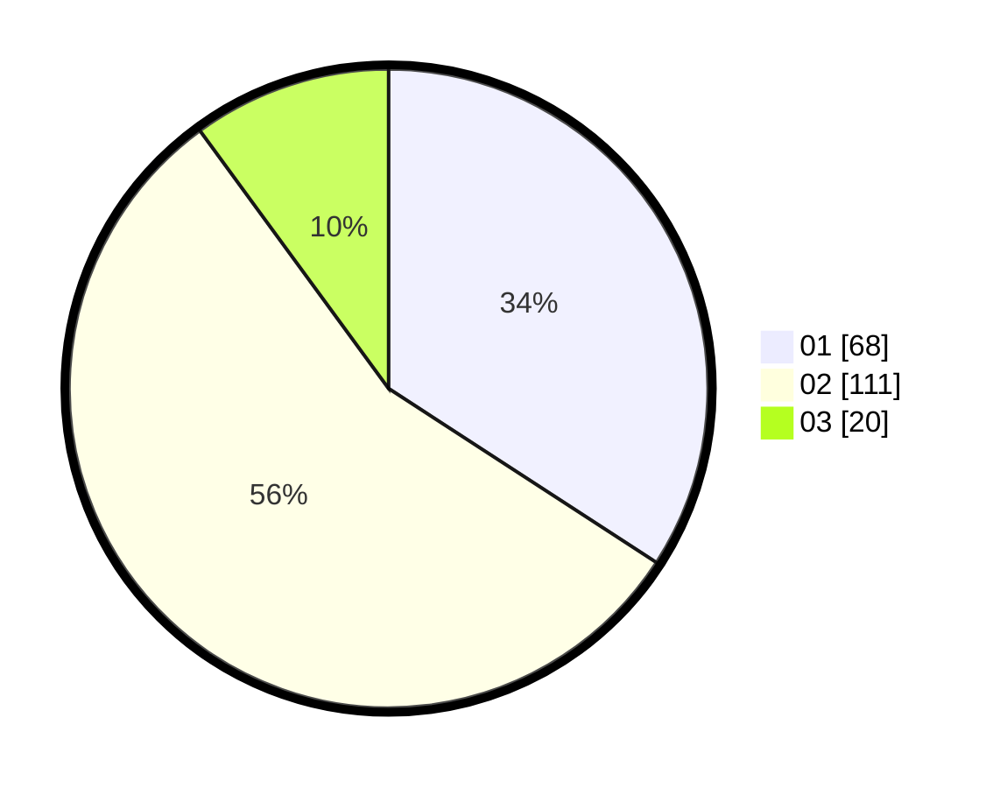

# Hasil

Hasil perolehan suara paslon dapat dilihat pada file paslon-01.txt, paslon-02.txt, dan paslon-03.txt.

Jika tidak ada, artinya data tersebut belum ada pada SIREKAP.

## Perolehan Suara

 * Paslon 01: **68**.
 * Paslon 02: **111**.
 * Paslon 03: **20**.

## Foto C Plano

https://sirekap-obj-formc.kpu.go.id/8e47/pemilu/ppwp/31/75/09/10/04/3175091004037-20240214-220216--2b8ce956-0c7b-4101-8159-77cf3cde783f.jpg

https://sirekap-obj-formc.kpu.go.id/8e47/pemilu/ppwp/31/75/09/10/04/3175091004037-20240214-220220--b06e2ce3-02f0-4420-a9cc-6bcd03635565.jpg

https://sirekap-obj-formc.kpu.go.id/8e47/pemilu/ppwp/31/75/09/10/04/3175091004037-20240214-220223--11298501-d9eb-48e3-929a-db7bceb968b1.jpg
