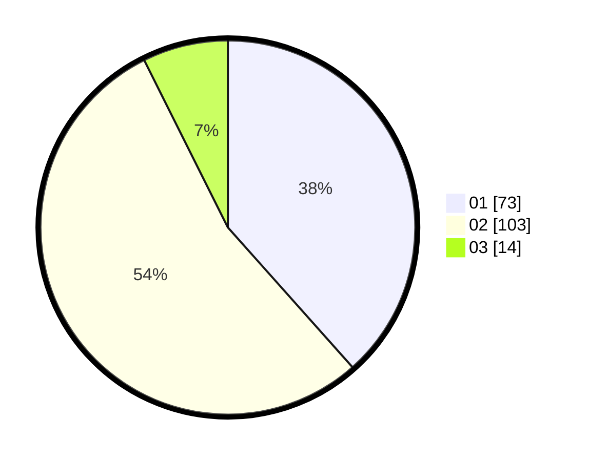

# Hasil

Hasil perolehan suara paslon dapat dilihat pada file paslon-01.txt, paslon-02.txt, dan paslon-03.txt.

Jika tidak ada, artinya data tersebut belum ada pada SIREKAP.

## Perolehan Suara

 * Paslon 01: **73**.
 * Paslon 02: **103**.
 * Paslon 03: **14**.

## Foto C Plano

https://sirekap-obj-formc.kpu.go.id/381a/pemilu/ppwp/31/75/09/10/04/3175091004043-20240214-202506--844853e7-ae33-4f51-85d4-e216c9179cf4.jpg

https://sirekap-obj-formc.kpu.go.id/381a/pemilu/ppwp/31/75/09/10/04/3175091004043-20240214-193452--a4f847b8-8290-483c-8905-7982c5cf78ea.jpg

https://sirekap-obj-formc.kpu.go.id/381a/pemilu/ppwp/31/75/09/10/04/3175091004043-20240214-202001--917359d9-1fe0-4dd7-b771-8df6f31fd08f.jpg

## DATA PEMILIH TETAP

Jumlah pemilih dalam DPT: **269**.
 * L: **139**.
 * P: **130**.

## DATA PENGGUNA HAK PILIH

Jumlah pengguna hak pilih dalam DPT: **192**.
 * L: **92**.
 * P: **100**.

Jumlah pengguna hak pilih dalam DPTb: **0**.
 * L: **0**.
 * P: **0**.

Jumlah pengguna hak pilih dalam DPK: **0**.
 * L: **0**.
 * P: **0**.

Jumlah pengguna hak pilih: **192**.
 * L: **92**.
 * P: **100**.

## JUMLAH SUARA SAH DAN TIDAK SAH

JUMLAH SELURUH SUARA SAH: **190**.

JUMLAH SUARA TIDAK SAH: **2**.

JUMLAH SELURUH SUARA SAH DAN SUARA TIDAK SAH: **192**.
