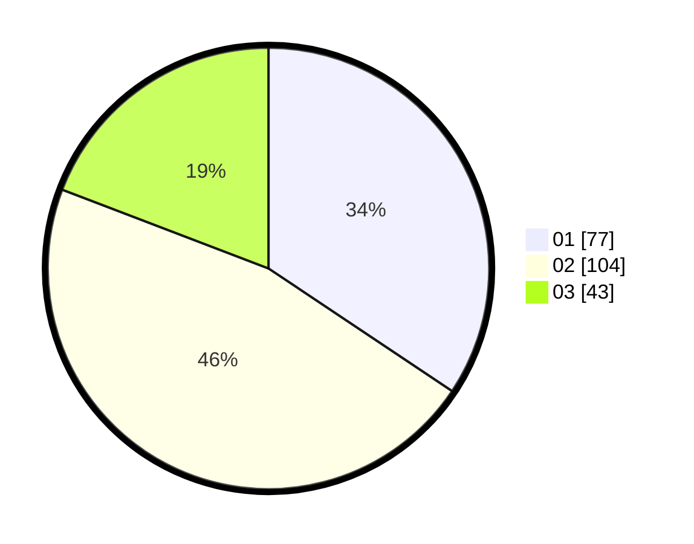

# Hasil

Hasil perolehan suara paslon dapat dilihat pada file paslon-01.txt, paslon-02.txt, dan paslon-03.txt.

Jika tidak ada, artinya data tersebut belum ada pada SIREKAP.

## Perolehan Suara

 * Paslon 01: **77**.
 * Paslon 02: **104**.
 * Paslon 03: **43**.

## Foto C Plano

https://sirekap-obj-formc.kpu.go.id/c5ed/pemilu/ppwp/31/75/09/10/04/3175091004044-20240216-023613--08eb1ad9-6d31-4201-ac5a-6103d3529a52.jpg

https://sirekap-obj-formc.kpu.go.id/c5ed/pemilu/ppwp/31/75/09/10/04/3175091004044-20240216-023614--d2aaea37-6639-481e-88a7-de3fddaf244b.jpg

https://sirekap-obj-formc.kpu.go.id/c5ed/pemilu/ppwp/31/75/09/10/04/3175091004044-20240216-023614--b28776c4-a8c2-4075-9683-f16dc96c5a19.jpg

## DATA PEMILIH TETAP

Jumlah pemilih dalam DPT: **266**.
 * L: **143**.
 * P: **123**.

## DATA PENGGUNA HAK PILIH

Jumlah pengguna hak pilih dalam DPT: **212**.
 * L: **112**.
 * P: **100**.

Jumlah pengguna hak pilih dalam DPTb: **9**.
 * L: **4**.
 * P: **5**.

Jumlah pengguna hak pilih dalam DPK: **3**.
 * L: **1**.
 * P: **2**.

Jumlah pengguna hak pilih: **224**.
 * L: **117**.
 * P: **107**.

## JUMLAH SUARA SAH DAN TIDAK SAH

JUMLAH SELURUH SUARA SAH: **224**.

JUMLAH SUARA TIDAK SAH: **0**.

JUMLAH SELURUH SUARA SAH DAN SUARA TIDAK SAH: **224**.
