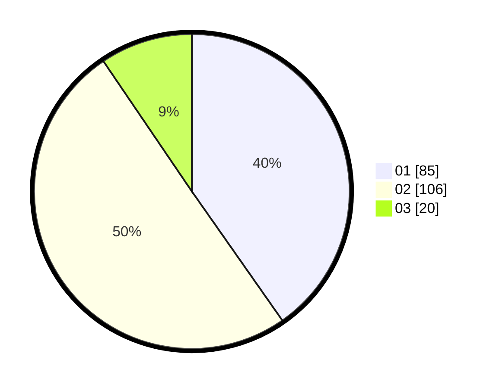

# Hasil

Hasil perolehan suara paslon dapat dilihat pada file paslon-01.txt, paslon-02.txt, dan paslon-03.txt.

Jika tidak ada, artinya data tersebut belum ada pada SIREKAP.

## Perolehan Suara

 * Paslon 01: **85**.
 * Paslon 02: **106**.
 * Paslon 03: **20**.

## Foto C Plano

https://sirekap-obj-formc.kpu.go.id/f797/pemilu/ppwp/31/75/09/10/04/3175091004048-20240214-185404--c5d1fa0b-657a-4959-acad-90df1f2b38fb.jpg

https://sirekap-obj-formc.kpu.go.id/f797/pemilu/ppwp/31/75/09/10/04/3175091004048-20240214-185111--5f096c89-a5ff-422e-9a49-480c2a7bf95f.jpg

https://sirekap-obj-formc.kpu.go.id/f797/pemilu/ppwp/31/75/09/10/04/3175091004048-20240214-185132--9efb0701-a5b5-49bd-ad1c-34c9de89cce4.jpg

## DATA PEMILIH TETAP

Jumlah pemilih dalam DPT: **271**.
 * L: **156**.
 * P: **115**.

## DATA PENGGUNA HAK PILIH

Jumlah pengguna hak pilih dalam DPT: **213**.
 * L: **118**.
 * P: **95**.

Jumlah pengguna hak pilih dalam DPTb: **1**.
 * L: **0**.
 * P: **1**.

Jumlah pengguna hak pilih dalam DPK: **0**.
 * L: **0**.
 * P: **0**.

Jumlah pengguna hak pilih: **214**.
 * L: **118**.
 * P: **96**.

## JUMLAH SUARA SAH DAN TIDAK SAH

JUMLAH SELURUH SUARA SAH: **211**.

JUMLAH SUARA TIDAK SAH: **3**.

JUMLAH SELURUH SUARA SAH DAN SUARA TIDAK SAH: **214**.
