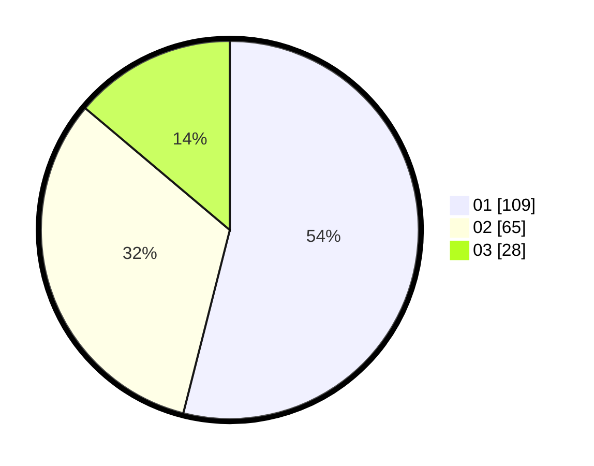

# Hasil

Hasil perolehan suara paslon dapat dilihat pada file paslon-01.txt, paslon-02.txt, dan paslon-03.txt.

Jika tidak ada, artinya data tersebut belum ada pada SIREKAP.

## Perolehan Suara

 * Paslon 01: **109**.
 * Paslon 02: **65**.
 * Paslon 03: **28**.

## Foto C Plano

https://sirekap-obj-formc.kpu.go.id/be35/pemilu/ppwp/31/75/09/10/04/3175091004056-20240214-140956--927cd92d-28ef-4d64-ac3d-56cc43e9db66.jpg

https://sirekap-obj-formc.kpu.go.id/be35/pemilu/ppwp/31/75/09/10/04/3175091004056-20240214-192102--9bbcc8d3-3fbf-4233-aa17-cfdb326d1901.jpg
