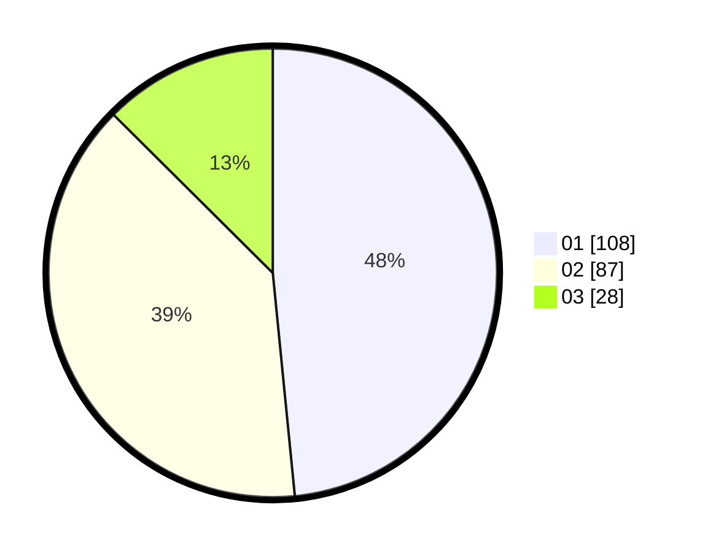

# Hasil

Hasil perolehan suara paslon dapat dilihat pada file paslon-01.txt, paslon-02.txt, dan paslon-03.txt.

Jika tidak ada, artinya data tersebut belum ada pada SIREKAP.

## Perolehan Suara

 * Paslon 01: **108**.
 * Paslon 02: **87**.
 * Paslon 03: **28**.

## Foto C Plano

https://sirekap-obj-formc.kpu.go.id/a354/pemilu/ppwp/31/75/09/10/04/3175091004057-20240214-205216--ccaf19d0-e584-4930-9ef2-82fc10082fc8.jpg

https://sirekap-obj-formc.kpu.go.id/a354/pemilu/ppwp/31/75/09/10/04/3175091004057-20240214-205445--2c353d5d-f8fb-4b28-9b8e-596a0c1efa36.jpg

https://sirekap-obj-formc.kpu.go.id/a354/pemilu/ppwp/31/75/09/10/04/3175091004057-20240214-205655--420e1e4c-38c4-4855-a3b6-c3bd38198114.jpg

## DATA PEMILIH TETAP

Jumlah pemilih dalam DPT: **256**.
 * L: **135**.
 * P: **121**.

## DATA PENGGUNA HAK PILIH

Jumlah pengguna hak pilih dalam DPT: **225**.
 * L: **113**.
 * P: **112**.

Jumlah pengguna hak pilih dalam DPTb: **0**.
 * L: **0**.
 * P: **0**.

Jumlah pengguna hak pilih dalam DPK: **0**.
 * L: **0**.
 * P: **0**.

Jumlah pengguna hak pilih: **225**.
 * L: **113**.
 * P: **112**.

## JUMLAH SUARA SAH DAN TIDAK SAH

JUMLAH SELURUH SUARA SAH: **223**.

JUMLAH SUARA TIDAK SAH: **2**.

JUMLAH SELURUH SUARA SAH DAN SUARA TIDAK SAH: **225**.
