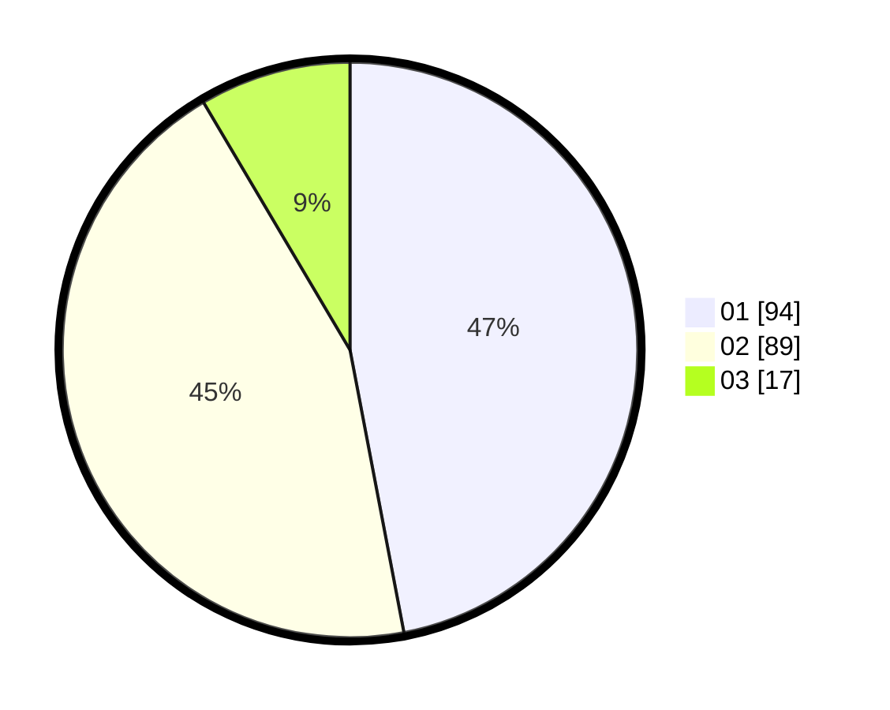

# Hasil

Hasil perolehan suara paslon dapat dilihat pada file paslon-01.txt, paslon-02.txt, dan paslon-03.txt.

Jika tidak ada, artinya data tersebut belum ada pada SIREKAP.

## Perolehan Suara

 * Paslon 01: **94**.
 * Paslon 02: **89**.
 * Paslon 03: **17**.

## Foto C Plano

https://sirekap-obj-formc.kpu.go.id/7c63/pemilu/ppwp/31/75/09/10/04/3175091004071-20240215-165243--f4616455-3c80-403b-aab5-85c34462c8cd.jpg

https://sirekap-obj-formc.kpu.go.id/7c63/pemilu/ppwp/31/75/09/10/04/3175091004071-20240215-165305--385cef08-19ae-4e23-b3e3-92d4c6b43457.jpg

https://sirekap-obj-formc.kpu.go.id/7c63/pemilu/ppwp/31/75/09/10/04/3175091004071-20240215-165254--50d95548-37c4-4964-8a1b-7b942ab15b22.jpg

## DATA PEMILIH TETAP

Jumlah pemilih dalam DPT: **0**.
 * L: **0**.
 * P: **0**.

## DATA PENGGUNA HAK PILIH

Jumlah pengguna hak pilih dalam DPT: **0**.
 * L: **0**.
 * P: **0**.

Jumlah pengguna hak pilih dalam DPTb: **0**.
 * L: **0**.
 * P: **0**.

Jumlah pengguna hak pilih dalam DPK: **0**.
 * L: **0**.
 * P: **0**.

Jumlah pengguna hak pilih: **0**.
 * L: **0**.
 * P: **0**.

## JUMLAH SUARA SAH DAN TIDAK SAH

JUMLAH SELURUH SUARA SAH: **200**.

JUMLAH SUARA TIDAK SAH: **0**.

JUMLAH SELURUH SUARA SAH DAN SUARA TIDAK SAH: **200**.
