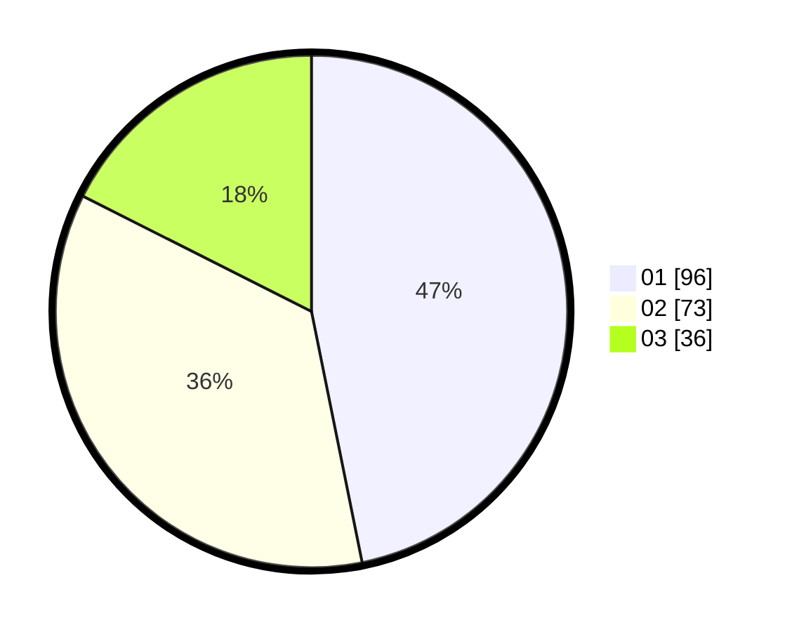

# Hasil

Hasil perolehan suara paslon dapat dilihat pada file paslon-01.txt, paslon-02.txt, dan paslon-03.txt.

Jika tidak ada, artinya data tersebut belum ada pada SIREKAP.

## Perolehan Suara

 * Paslon 01: **96**.
 * Paslon 02: **73**.
 * Paslon 03: **36**.

## Foto C Plano

https://sirekap-obj-formc.kpu.go.id/8ee1/pemilu/ppwp/31/75/09/10/04/3175091004072-20240214-193357--415f2ac8-aa67-4c82-8ef0-8d89657542dc.jpg

https://sirekap-obj-formc.kpu.go.id/8ee1/pemilu/ppwp/31/75/09/10/04/3175091004072-20240214-200452--07328bed-1bf2-4ec3-adff-88ebde9c1a2e.jpg

https://sirekap-obj-formc.kpu.go.id/8ee1/pemilu/ppwp/31/75/09/10/04/3175091004072-20240214-200605--79fba44b-4918-4b80-b49a-0a7701c90f1d.jpg
