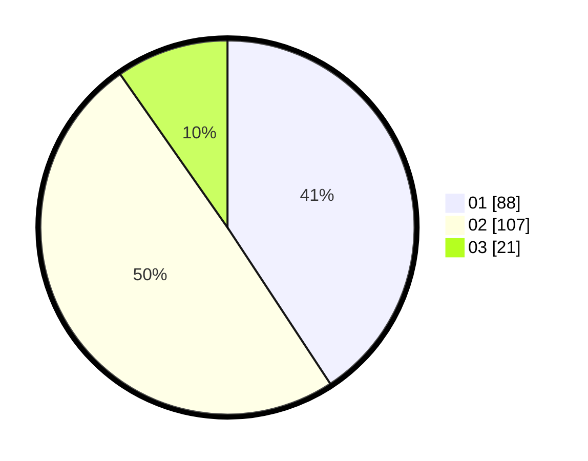

# Hasil

Hasil perolehan suara paslon dapat dilihat pada file paslon-01.txt, paslon-02.txt, dan paslon-03.txt.

Jika tidak ada, artinya data tersebut belum ada pada SIREKAP.

## Perolehan Suara

 * Paslon 01: **88**.
 * Paslon 02: **107**.
 * Paslon 03: **21**.

## Foto C Plano

https://sirekap-obj-formc.kpu.go.id/8d72/pemilu/ppwp/31/75/09/10/04/3175091004103-20240214-155802--14781255-db5a-44f5-b75d-6eda2e706559.jpg

https://sirekap-obj-formc.kpu.go.id/8d72/pemilu/ppwp/31/75/09/10/04/3175091004103-20240214-155617--e322fa03-d5c6-47ab-be28-d61c582a810d.jpg

https://sirekap-obj-formc.kpu.go.id/8d72/pemilu/ppwp/31/75/09/10/04/3175091004103-20240216-140349--4833f2ac-dc82-4615-ab0d-ebb81285a8a2.jpg

## DATA PEMILIH TETAP

Jumlah pemilih dalam DPT: **275**.
 * L: **136**.
 * P: **139**.

## DATA PENGGUNA HAK PILIH

Jumlah pengguna hak pilih dalam DPT: **209**.
 * L: **102**.
 * P: **107**.

Jumlah pengguna hak pilih dalam DPTb: **8**.
 * L: **4**.
 * P: **4**.

Jumlah pengguna hak pilih dalam DPK: **1**.
 * L: **0**.
 * P: **1**.

Jumlah pengguna hak pilih: **218**.
 * L: **106**.
 * P: **112**.

## JUMLAH SUARA SAH DAN TIDAK SAH

JUMLAH SELURUH SUARA SAH: **216**.

JUMLAH SUARA TIDAK SAH: **2**.

JUMLAH SELURUH SUARA SAH DAN SUARA TIDAK SAH: **218**.
