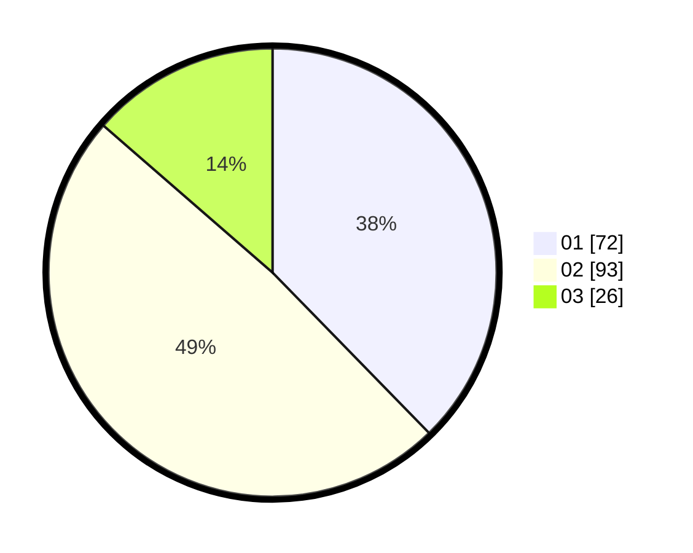

# Hasil

Hasil perolehan suara paslon dapat dilihat pada file paslon-01.txt, paslon-02.txt, dan paslon-03.txt.

Jika tidak ada, artinya data tersebut belum ada pada SIREKAP.

## Perolehan Suara

 * Paslon 01: **72**.
 * Paslon 02: **93**.
 * Paslon 03: **26**.

## Foto C Plano

https://sirekap-obj-formc.kpu.go.id/dea9/pemilu/ppwp/31/75/09/10/04/3175091004109-20240216-100020--56224ed3-b135-4ae4-944a-ab8047d90f57.jpg

https://sirekap-obj-formc.kpu.go.id/dea9/pemilu/ppwp/31/75/09/10/04/3175091004109-20240216-100022--f891e768-cb86-48b8-94b4-7303af1f511e.jpg

https://sirekap-obj-formc.kpu.go.id/dea9/pemilu/ppwp/31/75/09/10/04/3175091004109-20240216-100021--945256dc-c958-4aa0-8557-1aa52299d5d8.jpg

## DATA PEMILIH TETAP

Jumlah pemilih dalam DPT: **250**.
 * L: **119**.
 * P: **131**.

## DATA PENGGUNA HAK PILIH

Jumlah pengguna hak pilih dalam DPT: **190**.
 * L: **87**.
 * P: **103**.

Jumlah pengguna hak pilih dalam DPTb: **0**.
 * L: **0**.
 * P: **0**.

Jumlah pengguna hak pilih dalam DPK: **1**.
 * L: **0**.
 * P: **1**.

Jumlah pengguna hak pilih: **191**.
 * L: **87**.
 * P: **104**.

## JUMLAH SUARA SAH DAN TIDAK SAH

JUMLAH SELURUH SUARA SAH: **191**.

JUMLAH SUARA TIDAK SAH: **0**.

JUMLAH SELURUH SUARA SAH DAN SUARA TIDAK SAH: **191**.
