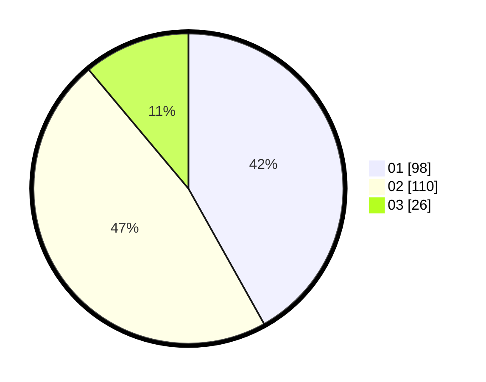

# Hasil

Hasil perolehan suara paslon dapat dilihat pada file paslon-01.txt, paslon-02.txt, dan paslon-03.txt.

Jika tidak ada, artinya data tersebut belum ada pada SIREKAP.

## Perolehan Suara

 * Paslon 01: **98**.
 * Paslon 02: **110**.
 * Paslon 03: **26**.

## Foto C Plano

https://sirekap-obj-formc.kpu.go.id/e589/pemilu/ppwp/31/75/09/10/04/3175091004122-20240216-005610--afc555fa-e2d2-46a2-b775-ce5845b7c36d.jpg

https://sirekap-obj-formc.kpu.go.id/e589/pemilu/ppwp/31/75/09/10/04/3175091004122-20240216-005612--8968ee1d-9302-4432-819d-8fb8bfae9a9f.jpg

https://sirekap-obj-formc.kpu.go.id/e589/pemilu/ppwp/31/75/09/10/04/3175091004122-20240216-005612--f1a322ff-a02b-4faa-a73f-220438409fea.jpg

## DATA PEMILIH TETAP

Jumlah pemilih dalam DPT: **281**.
 * L: **142**.
 * P: **139**.

## DATA PENGGUNA HAK PILIH

Jumlah pengguna hak pilih dalam DPT: **233**.
 * L: **116**.
 * P: **117**.

Jumlah pengguna hak pilih dalam DPTb: **0**.
 * L: **0**.
 * P: **0**.

Jumlah pengguna hak pilih dalam DPK: **4**.
 * L: **2**.
 * P: **2**.

Jumlah pengguna hak pilih: **237**.
 * L: **118**.
 * P: **119**.

## JUMLAH SUARA SAH DAN TIDAK SAH

JUMLAH SELURUH SUARA SAH: **234**.

JUMLAH SUARA TIDAK SAH: **3**.

JUMLAH SELURUH SUARA SAH DAN SUARA TIDAK SAH: **237**.
