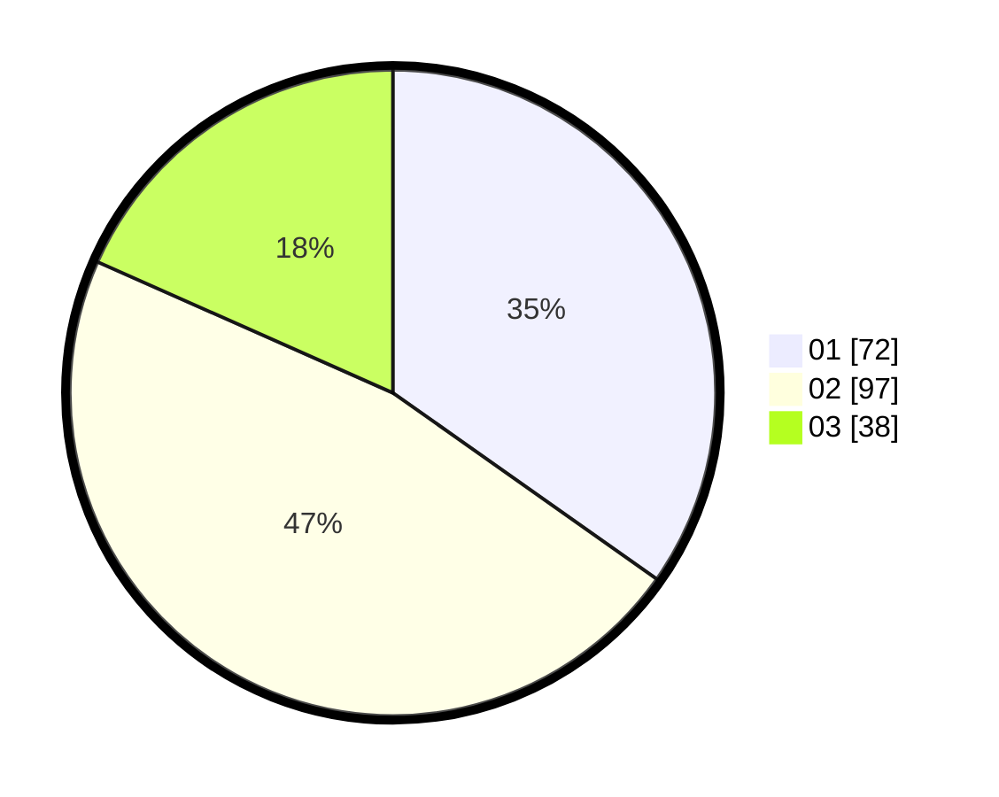

# Hasil

Hasil perolehan suara paslon dapat dilihat pada file paslon-01.txt, paslon-02.txt, dan paslon-03.txt.

Jika tidak ada, artinya data tersebut belum ada pada SIREKAP.

## Perolehan Suara

 * Paslon 01: **72**.
 * Paslon 02: **97**.
 * Paslon 03: **38**.

## Foto C Plano

https://sirekap-obj-formc.kpu.go.id/8878/pemilu/ppwp/31/75/09/10/04/3175091004125-20240215-011727--f330cafb-0272-467c-940c-1d5c133c0172.jpg

https://sirekap-obj-formc.kpu.go.id/8878/pemilu/ppwp/31/75/09/10/04/3175091004125-20240215-011749--f77c1664-b650-4d37-9f5b-ea088c9dae97.jpg

https://sirekap-obj-formc.kpu.go.id/8878/pemilu/ppwp/31/75/09/10/04/3175091004125-20240215-011738--3542bec3-2f59-4cea-b046-d80025d5e015.jpg

## DATA PEMILIH TETAP

Jumlah pemilih dalam DPT: **259**.
 * L: **141**.
 * P: **118**.

## DATA PENGGUNA HAK PILIH

Jumlah pengguna hak pilih dalam DPT: **207**.
 * L: **105**.
 * P: **102**.

Jumlah pengguna hak pilih dalam DPTb: **2**.
 * L: **1**.
 * P: **1**.

Jumlah pengguna hak pilih dalam DPK: **0**.
 * L: **0**.
 * P: **0**.

Jumlah pengguna hak pilih: **209**.
 * L: **106**.
 * P: **103**.

## JUMLAH SUARA SAH DAN TIDAK SAH

JUMLAH SELURUH SUARA SAH: **207**.

JUMLAH SUARA TIDAK SAH: **2**.

JUMLAH SELURUH SUARA SAH DAN SUARA TIDAK SAH: **209**.
