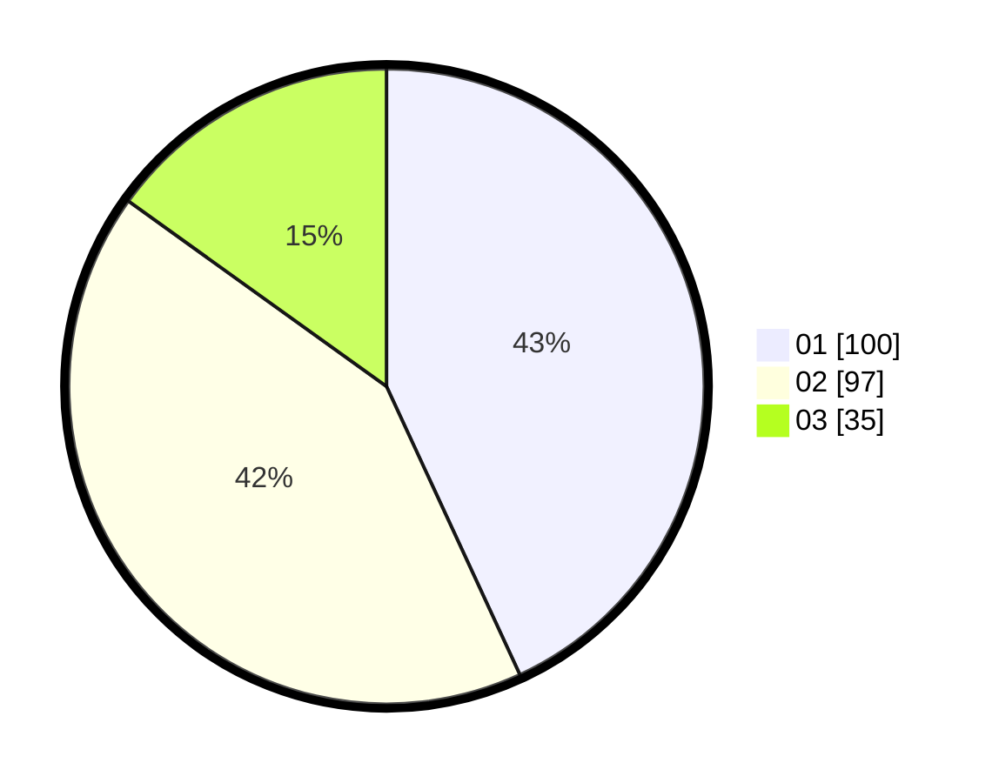

# Hasil

Hasil perolehan suara paslon dapat dilihat pada file paslon-01.txt, paslon-02.txt, dan paslon-03.txt.

Jika tidak ada, artinya data tersebut belum ada pada SIREKAP.

## Perolehan Suara

 * Paslon 01: **100**.
 * Paslon 02: **97**.
 * Paslon 03: **35**.

## Foto C Plano

https://sirekap-obj-formc.kpu.go.id/f752/pemilu/ppwp/31/75/09/10/04/3175091004131-20240216-091037--c6f41d20-38ca-454e-a5b1-2d1af04ca5d4.jpg

https://sirekap-obj-formc.kpu.go.id/f752/pemilu/ppwp/31/75/09/10/04/3175091004131-20240216-091039--de7733e7-a021-4c2b-8ab3-7a466b3c4953.jpg

https://sirekap-obj-formc.kpu.go.id/f752/pemilu/ppwp/31/75/09/10/04/3175091004131-20240216-091039--778d7a0a-f8a4-4fbe-971c-201b0cb56392.jpg

## DATA PEMILIH TETAP

Jumlah pemilih dalam DPT: **280**.
 * L: **143**.
 * P: **137**.

## DATA PENGGUNA HAK PILIH

Jumlah pengguna hak pilih dalam DPT: **227**.
 * L: **114**.
 * P: **113**.

Jumlah pengguna hak pilih dalam DPTb: **3**.
 * L: **2**.
 * P: **1**.

Jumlah pengguna hak pilih dalam DPK: **2**.
 * L: **2**.
 * P: **0**.

Jumlah pengguna hak pilih: **232**.
 * L: **118**.
 * P: **114**.

## JUMLAH SUARA SAH DAN TIDAK SAH

JUMLAH SELURUH SUARA SAH: **232**.

JUMLAH SUARA TIDAK SAH: **0**.

JUMLAH SELURUH SUARA SAH DAN SUARA TIDAK SAH: **232**.
