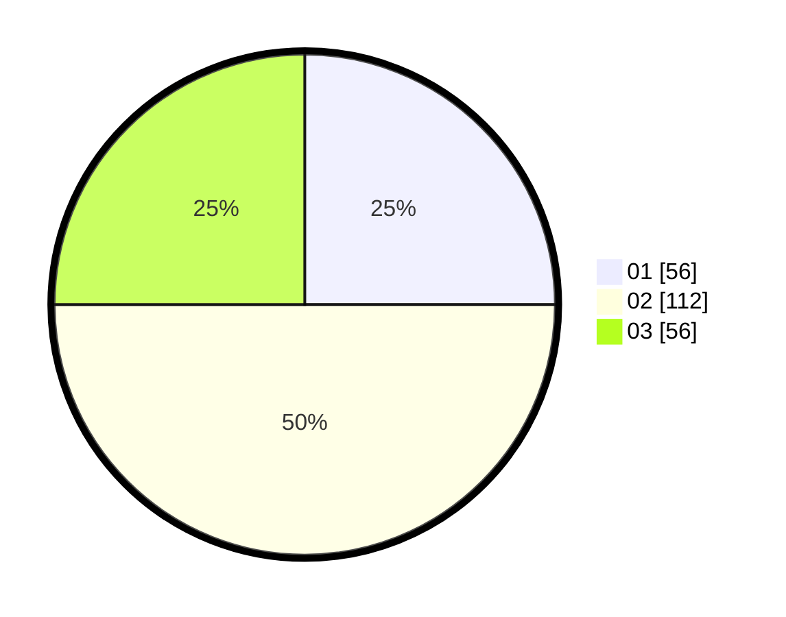

# Hasil

Hasil perolehan suara paslon dapat dilihat pada file paslon-01.txt, paslon-02.txt, dan paslon-03.txt.

Jika tidak ada, artinya data tersebut belum ada pada SIREKAP.

## Perolehan Suara

 * Paslon 01: **56**.
 * Paslon 02: **112**.
 * Paslon 03: **56**.

## Foto C Plano

https://sirekap-obj-formc.kpu.go.id/b1be/pemilu/ppwp/31/75/09/10/05/3175091005002-20240214-194713--780f282e-3ffa-4930-b57a-197e2ba379ae.jpg

https://sirekap-obj-formc.kpu.go.id/b1be/pemilu/ppwp/31/75/09/10/05/3175091005002-20240214-195327--7f452d67-a65c-4f83-aaf7-a457ba7bcb3e.jpg

https://sirekap-obj-formc.kpu.go.id/b1be/pemilu/ppwp/31/75/09/10/05/3175091005002-20240214-195209--c8fb7ee7-3107-472a-8690-cffbd5021ab0.jpg

## DATA PEMILIH TETAP

Jumlah pemilih dalam DPT: **270**.
 * L: **131**.
 * P: **139**.

## DATA PENGGUNA HAK PILIH

Jumlah pengguna hak pilih dalam DPT: **225**.
 * L: **99**.
 * P: **126**.

Jumlah pengguna hak pilih dalam DPTb: **0**.
 * L: **0**.
 * P: **0**.

Jumlah pengguna hak pilih dalam DPK: **1**.
 * L: **0**.
 * P: **1**.

Jumlah pengguna hak pilih: **226**.
 * L: **99**.
 * P: **127**.

## JUMLAH SUARA SAH DAN TIDAK SAH

JUMLAH SELURUH SUARA SAH: **224**.

JUMLAH SUARA TIDAK SAH: **2**.

JUMLAH SELURUH SUARA SAH DAN SUARA TIDAK SAH: **226**.
