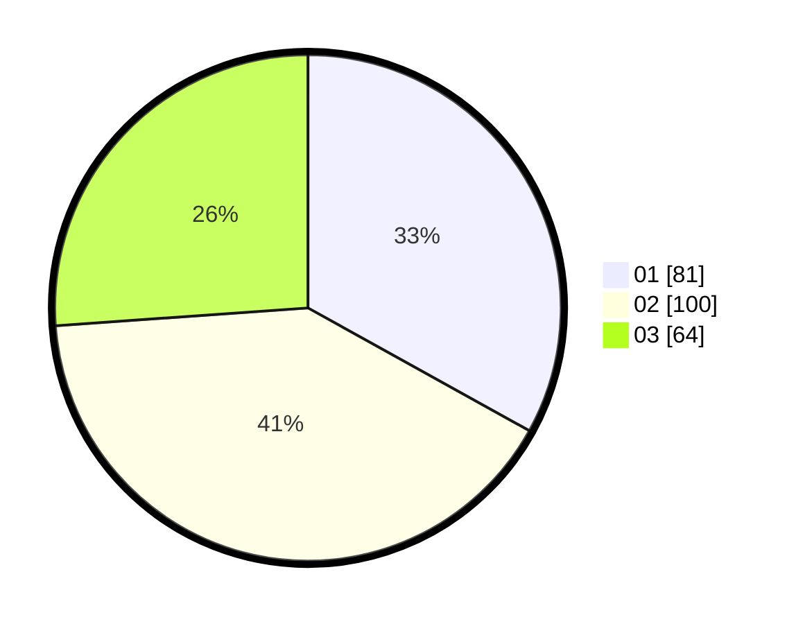

# Hasil

Hasil perolehan suara paslon dapat dilihat pada file paslon-01.txt, paslon-02.txt, dan paslon-03.txt.

Jika tidak ada, artinya data tersebut belum ada pada SIREKAP.

## Perolehan Suara

 * Paslon 01: **81**.
 * Paslon 02: **100**.
 * Paslon 03: **64**.

## Foto C Plano

https://sirekap-obj-formc.kpu.go.id/ef72/pemilu/ppwp/31/75/09/10/05/3175091005004-20240215-221049--5670d750-6cae-4515-81d6-5ec4506974ca.jpg

https://sirekap-obj-formc.kpu.go.id/ef72/pemilu/ppwp/31/75/09/10/05/3175091005004-20240215-221052--89b08f15-dba7-49f5-98a7-06f6d3010859.jpg

https://sirekap-obj-formc.kpu.go.id/ef72/pemilu/ppwp/31/75/09/10/05/3175091005004-20240215-221051--169dd8bc-247f-464e-b2e0-42b69256444e.jpg

## DATA PEMILIH TETAP

Jumlah pemilih dalam DPT: **282**.
 * L: **113**.
 * P: **169**.

## DATA PENGGUNA HAK PILIH

Jumlah pengguna hak pilih dalam DPT: **245**.
 * L: **98**.
 * P: **147**.

Jumlah pengguna hak pilih dalam DPTb: **0**.
 * L: **0**.
 * P: **0**.

Jumlah pengguna hak pilih dalam DPK: **1**.
 * L: **1**.
 * P: **0**.

Jumlah pengguna hak pilih: **246**.
 * L: **99**.
 * P: **147**.

## JUMLAH SUARA SAH DAN TIDAK SAH

JUMLAH SELURUH SUARA SAH: **245**.

JUMLAH SUARA TIDAK SAH: **1**.

JUMLAH SELURUH SUARA SAH DAN SUARA TIDAK SAH: **246**.
